# Breeze LES master report

DYCOMS: 15 completed cases. GABLS1: 12 of 15 planned cases have completed, audited local results.

Checked 2026-09-20T01:47:54.123Z.

This document combines the completed DYCOMS RF01 experiment (including the Pressel comparison) with the developing GABLS1 experiment. The GABLS run order is smallest grids first; incomplete runs contribute status information only, never scientific curves.

Read finite-output completion separately from physical fidelity: all three unbounded DYCOMS Centered2 cases developed negative total water. The DYCOMS chapter retains that audit.

GABLS1 uses a fixed 400 m cube and 9 h of surface cooling and geostrophic forcing. Its no-interior-closure configurations retain MOST wall stress and heat exchange. The question is whether numerical choices preserve resolved shear-driven turbulence on coarser grids.

Contents: Part I - completed DYCOMS and Pressel comparison; Part II - GABLS setup, progress, numerical references, then audited results as they arrive.

Part III adds GABLS3: an observational evaluation now in preparation. All prior DYCOMS and GABLS1 information is retained. The requested persistent evaluation repository is glwagner/BreezeEvaluation.jl.

---

# Part I: DYCOMS RF01

# Breeze DYCOMS-II RF01: resolution and numerics

**Complete: 15 cases analyzed** · Data checked 2026-09-19T11:58:17.096Z

## Current result

All 15 requested four-hour cases are analyzed. This matrix does not establish faithful low-resolution DYCOMS turbulence: the four coarse WENO cases retain the wrong third-moment sign in the 600–760 m layer, and refining WENO9/no-SGS from 35 m to 10 m horizontal spacing substantially improves the third moment despite little improvement in variance-marker error. Fine WENO9/no-SGS has the smallest third-moment marker RMSE among the tested WENO cases. All three unbounded Centered2 cases develop negative total water and cannot establish physical fidelity. Cloud persistence alone is therefore insufficient. These are single-seed comparisons; the fine grid is not a proven converged solution, and the larger coarse domain confounds the resolution comparison.

- Completed Centered2 runs contain physically inadmissible negative total water (sampled minima: coarse: -4.338 g/kg; canonical: -7.697 g/kg; fine: -7.401 g/kg). Their cloud and turbulence statistics are retained as diagnostics of this unbounded numerical configuration, not evidence of a physically faithful solution. The production extrema figure shows the full sampled time history; verification here means complete finite output, not physical validity.
- Centered2 smoke audit: all three grids stayed finite over the first 600 simulated seconds, but canonical and fine cases produced negative total water. Across the 11 one-minute samples, minimum qₜ was coarse: 1.0872 g/kg; canonical: -0.0605 g/kg; fine: -1.3679 g/kg. Passing the finite-value gate establishes neither moisture positivity nor physical validity. Production retains unbounded centered moisture; full-run extrema are reported separately in the production audit. These are smoke-test results, not completed four-hour Centered2 statistics.
- At 10 m horizontal / 5 m vertical spacing with WENO9, adding Smagorinsky changes fourth-hour minimum w′³ over 600–760 m from -0.0622 to -0.0304 m³/s³, third-moment marker RMSE from 0.0159 to 0.0313 m³/s³, and variance-marker RMSE from 0.0631 to 0.0769 m²/s². LWP changes from 55.48 to 53.23 g/m². Solver wall increases by 10.1%. This closure weakens the negative third moment and increases both marker errors in this paired single-realization comparison; it is not evidence against every possible closure or coefficient choice.
- At 10 m horizontal / 5 m vertical resolution without SGS, WENO5 uses 70.5 solver wall minutes versus 92.8 for WENO9 (24.0% less). However, its fourth-hour third-moment RMSE against digitized in-situ markers is 0.0310 rather than 0.0159 m³/s³. Its minimum w′³ in 600–760 m is -0.0372 versus -0.0622 m³/s³. Lower advection order saves wall time but weakens the negative third moment in this realization. Timings include output within the solve and exclude startup/compilation before the solve; they are not isolated kernel benchmarks.
- Fine Centered2 with Smagorinsky completes in 70.2 solver wall minutes, 31.3% less than fine WENO9 with Smagorinsky. Its fourth-hour LWP is 44.17 versus 53.23 g/m², and third-moment marker RMSE is 0.0382 versus 0.0313 m³/s³. Negative total water prevents interpreting this cheaper run as an acceptable physical solution. Timing includes diagnostics and differing timestep counts; no GPU profiling was performed to identify the cost mechanism.
- At fixed 5 m vertical spacing and fixed horizontal domain, changing WENO9/no-SGS from 35 m to 10 m horizontal spacing changes the fourth-hour minimum w′³ over 600–760 m from -0.0126 to -0.0622 m³/s³. The fine case is negative throughout 600–760 m, agreeing with the sign of the retained in-situ observations there.
- For this same 35 m to 10 m comparison, unweighted RMSE against the digitized in-situ third-moment markers changes from 0.0454 to 0.0159 m³/s³; variance-marker RMSE changes from 0.0606 to 0.0631 m²/s². The third moment improves substantially, while variance does not improve by this metric. These are single realizations without observational error-bar weighting, not a convergence demonstration.
- All 4 completed coarse WENO cases have positive fourth-hour w′³ throughout 600–760 m, while the retained in-situ observations there are negative. Cloud persistence therefore does not establish faithful coarse-grid turbulence.
- Coarse, WENO9 without closure: fourth-hour LWP 49.87 g/m², cloud fraction 99.34%, peak w² 0.395 m²/s², and Δqₜ 0.019 g/kg.
- At coarse resolution without closure, WENO9 minus WENO5 changes fourth-hour LWP by 3.42 g/m² and peak w² by 0.099 m²/s². These are paired single-realization differences, not statistically established scheme effects.
- At coarse resolution with WENO9, adding Smagorinsky changes fourth-hour LWP by -6.54 g/m² and peak w² by -0.038 m²/s². Third-moment marker RMSE changes from 0.0704 to 0.0595 m³/s³.
- Canonical, WENO9 without closure: fourth-hour LWP 61.69 g/m², cloud fraction 99.91%, peak w² 0.521 m²/s², and Δqₜ 0.003 g/kg.
- At canonical resolution without closure, WENO9 minus WENO5 changes fourth-hour LWP by 2.09 g/m² and peak w² by 0.054 m²/s². These are paired single-realization differences, not statistically established scheme effects.
- At canonical resolution with WENO9, adding Smagorinsky changes fourth-hour LWP by -9.50 g/m² and peak w² by -0.067 m²/s². Third-moment marker RMSE changes from 0.0454 to 0.0444 m³/s³.
- Fine, WENO9 without closure: fourth-hour LWP 55.48 g/m², cloud fraction 99.95%, peak w² 0.472 m²/s², and Δqₜ 0.031 g/kg.
- At fine resolution without closure, WENO9 minus WENO5 changes fourth-hour LWP by -2.06 g/m² and peak w² by -0.011 m²/s². These are paired single-realization differences, not statistically established scheme effects.
- At fine resolution with WENO9, adding Smagorinsky changes fourth-hour LWP by -2.25 g/m² and peak w² by -0.027 m²/s². Third-moment marker RMSE changes from 0.0159 to 0.0313 m³/s³.
- Coarse, Centered2 with Smagorinsky: sampled global qₜ extrema over 0–4 h were -4.3385 to 15.0839 g/kg; 227 of 241 samples contained negative moisture. These are 60-second samples, not bounds on every timestep.
- At coarse resolution with Smagorinsky, Centered2 minus WENO9 changes fourth-hour LWP by 5.52 g/m² and peak w² by 0.053 m²/s². Centered moisture is unbounded; this changes scheme family and bounding as well as formal order.
- At coarse resolution with Smagorinsky, Centered2 minus WENO5 changes fourth-hour LWP by 6.59 g/m² and peak w² by 0.095 m²/s². Centered moisture is unbounded; this changes scheme family and bounding as well as formal order.
- Canonical, Centered2 with Smagorinsky: sampled global qₜ extrema over 0–4 h were -7.6972 to 17.4041 g/kg; 231 of 241 samples contained negative moisture. These are 60-second samples, not bounds on every timestep.
- At canonical resolution with Smagorinsky, Centered2 minus WENO9 changes fourth-hour LWP by -16.49 g/m² and peak w² by -0.027 m²/s². Centered moisture is unbounded; this changes scheme family and bounding as well as formal order.
- At canonical resolution with Smagorinsky, Centered2 minus WENO5 changes fourth-hour LWP by -15.33 g/m² and peak w² by -0.006 m²/s². Centered moisture is unbounded; this changes scheme family and bounding as well as formal order.
- Fine, Centered2 with Smagorinsky: sampled global qₜ extrema over 0–4 h were -7.4007 to 18.0746 g/kg; 234 of 241 samples contained negative moisture. These are 60-second samples, not bounds on every timestep.
- At fine resolution with Smagorinsky, Centered2 minus WENO9 changes fourth-hour LWP by -9.06 g/m² and peak w² by -0.072 m²/s². Centered moisture is unbounded; this changes scheme family and bounding as well as formal order.
- At fine resolution with Smagorinsky, Centered2 minus WENO5 changes fourth-hour LWP by -7.54 g/m² and peak w² by -0.082 m²/s². Centered moisture is unbounded; this changes scheme family and bounding as well as formal order.

## Fourth-hour metrics

| Case | LWP (g/m²) | Cloud (%) | Peak w² (m²/s²) | Δqₜ (g/kg) | E (mm/s) |
|---|---:|---:|---:|---:|---:|
| Coarse / WENO9 / no SGS | 49.87 | 99.34 | 0.395 | 0.019 | 4.75 |
| Coarse / WENO5 / no SGS | 46.45 | 98.91 | 0.296 | 0.015 | 4.70 |
| Coarse / WENO9 / Smagorinsky | 43.33 | 99.07 | 0.356 | 0.080 | 5.21 |
| Coarse / WENO5 / Smagorinsky | 42.27 | 98.52 | 0.314 | 0.047 | 4.93 |
| Coarse / Centered2 / Smagorinsky | 48.85 | 99.44 | 0.409 | 0.214 | 7.27 |
| Canonical / WENO9 / no SGS | 61.69 | 99.91 | 0.521 | 0.003 | 4.32 |
| Canonical / WENO5 / no SGS | 59.61 | 99.92 | 0.467 | 0.020 | 5.19 |
| Canonical / WENO9 / Smagorinsky | 52.19 | 99.37 | 0.454 | 0.023 | 5.24 |
| Canonical / WENO5 / Smagorinsky | 51.04 | 98.95 | 0.433 | 0.060 | 5.24 |
| Canonical / Centered2 / Smagorinsky | 35.70 | 99.59 | 0.427 | 0.250 | 6.57 |
| Fine / WENO9 / no SGS | 55.48 | 99.95 | 0.472 | 0.031 | 5.34 |
| Fine / WENO5 / no SGS | 57.54 | 99.90 | 0.483 | 0.007 | 5.24 |
| Fine / WENO9 / Smagorinsky | 53.23 | 99.89 | 0.445 | 0.036 | 5.09 |
| Fine / WENO5 / Smagorinsky | 51.71 | 99.77 | 0.455 | 0.034 | 5.48 |
| Fine / Centered2 / Smagorinsky | 44.17 | 99.98 | 0.373 | 0.154 | 6.44 |

Peak w² is the maximum of the fourth-hour mean native-face profile; E includes subsidence. [Full metrics](simulation_data/fourth_hour_metrics.csv) · [Paired contrasts](simulation_data/paired_effects.csv).

## Plot conventions and envelope

All scientific figures are generated in Julia with CairoMakie. Numerical configurations use fixed Okabe-Ito colors, distinct dashes and marker shapes; different resolutions occupy panels with shared scales. The cloud-fraction zoom follows the simulated range, while a separate full-range panel preserves the paper ensemble spread.

Light gray is the paper’s model-ensemble minimum–maximum; darker gray is its interquartile range. These are not observational uncertainty bands or validation tolerances. The mean and envelope were digitized from Figure 2 at approximately 0.2–3.9 h. Original pixel coordinates, calibration, extraction settings and an overlay are retained. Subpixel early cloud-fraction bands are left missing. Only rendered cloud-fraction band edges are clipped to the physical 0–1 range; CSV values preserve raw digitization. The zoom panel omits the paper bands to avoid magnifying raster-edge uncertainty.

[Envelope CSV](data/figure2_ensemble_envelope.csv) · [Extraction audit overlay](data/figure2_envelope_overlay.png) · [Envelope provenance](data/figure2_envelope_provenance.json).

## Measured solver cost

| Case | Solver wall (min) | Iterations |
|---|---:|---:|
| coarse_none_weno9 | 4.05 | 7270 |
| coarse_none_weno5 | 3.99 | 7266 |
| coarse_smagorinsky_weno9 | 4.10 | 7264 |
| coarse_smagorinsky_weno5 | 4.13 | 7264 |
| canonical_none_weno9 | 12.11 | 19184 |
| canonical_none_weno5 | 11.96 | 18859 |
| canonical_smagorinsky_weno9 | 11.70 | 18147 |
| canonical_smagorinsky_weno5 | 11.32 | 17651 |
| fine_none_weno9 | 92.83 | 38996 |
| fine_none_weno5 | 70.54 | 38678 |
| fine_smagorinsky_weno9 | 102.17 | 38499 |
| fine_smagorinsky_weno5 | 80.34 | 38229 |
| coarse_smagorinsky_centered2 | 4.21 | 7299 |
| canonical_smagorinsky_centered2 | 12.37 | 19156 |
| fine_smagorinsky_centered2 | 70.20 | 39273 |

Measured per-run solver wall includes output during time integration and excludes earlier Julia startup/compilation and queue waiting. Differences in timestep counts and diagnostic overhead contribute. These single-run timings are not isolated advection-kernel benchmarks. [Cost CSV](simulation_data/solver_costs.csv).

## Cloud persistence and ensemble context

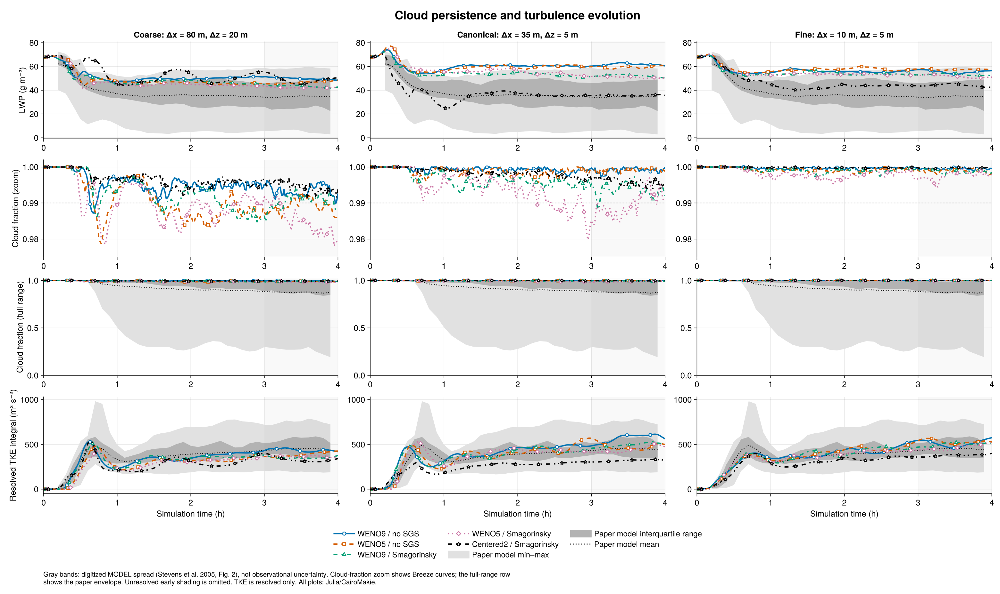

[Vector SVG](report_figures/evolution.svg) · [Vector PDF](report_figures/evolution.pdf).

## Fourth-hour thermodynamic structure

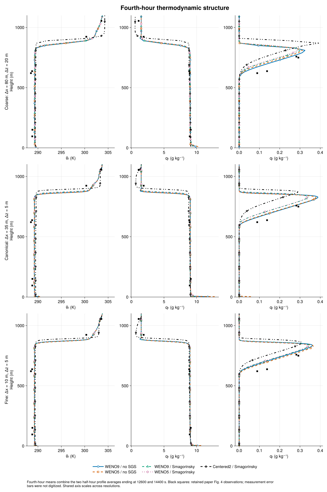

[Vector SVG](report_figures/mean_profiles.svg) · [Vector PDF](report_figures/mean_profiles.pdf).

## Fourth-hour vertical-velocity moments

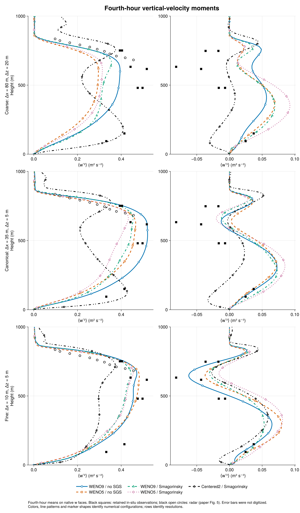

[Vector SVG](report_figures/vertical_velocity_moments.svg) · [Vector PDF](report_figures/vertical_velocity_moments.pdf).

## Scalar fluxes and buoyancy production

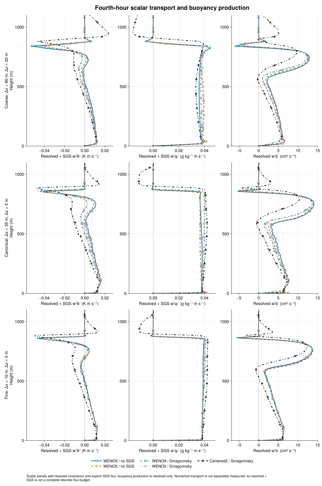

[Vector SVG](report_figures/flux_profiles.svg) · [Vector PDF](report_figures/flux_profiles.pdf).

## Cloud boundaries and decoupling

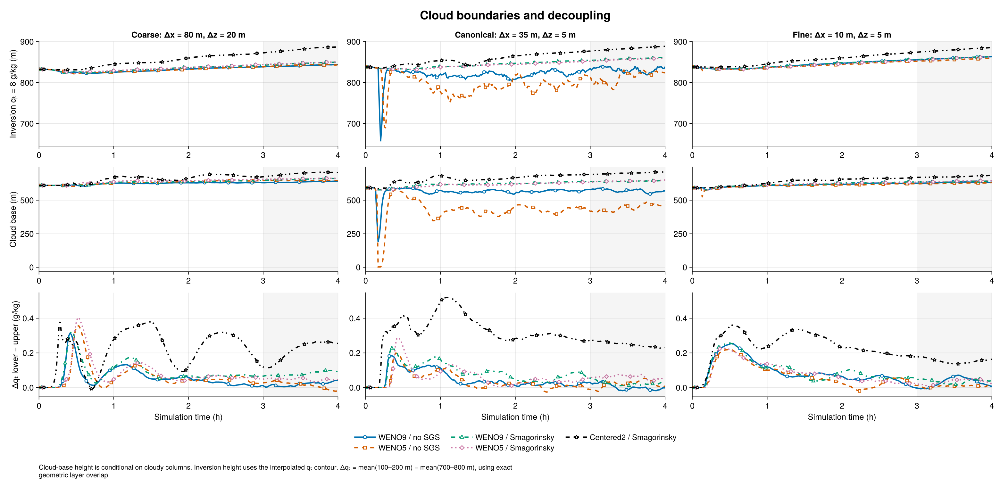

[Vector SVG](report_figures/boundaries_decoupling.svg) · [Vector PDF](report_figures/boundaries_decoupling.pdf).

## Resolution and numerical choices

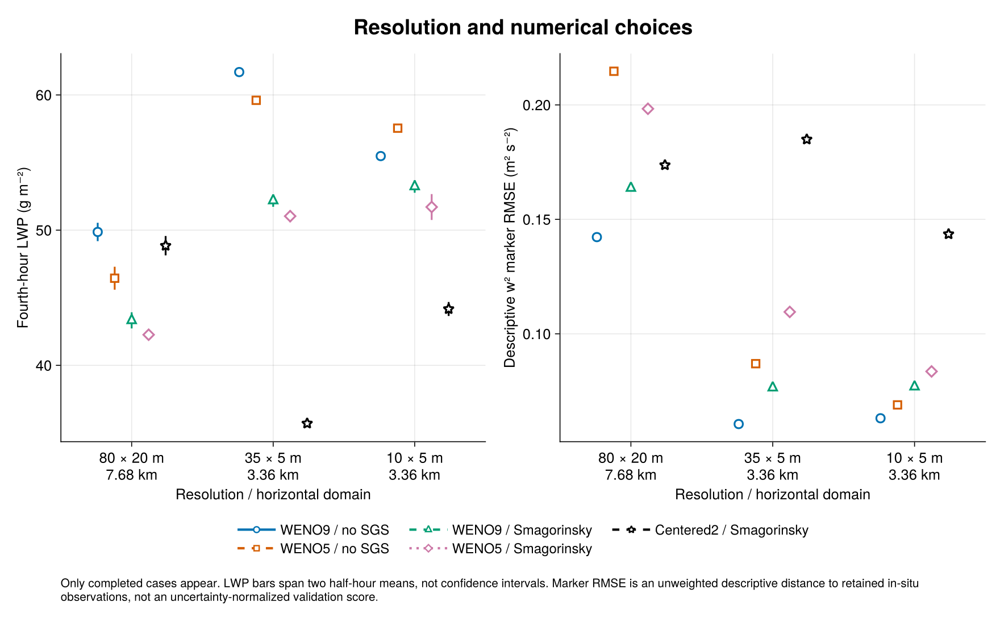

[Vector SVG](report_figures/factorial_summary.svg) · [Vector PDF](report_figures/factorial_summary.pdf).

## Centered2 moisture validity

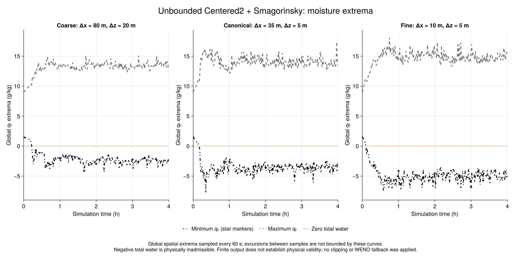

[Vector SVG](report_figures/moisture_extrema.svg) · [Vector PDF](report_figures/moisture_extrema.pdf).

## Averaging-window comparison for the fine grid

Compare the same statistic across windows: changing from dimensional third moment to skewness also changes normalization. Both effects must be kept separate. Values below are minima over 600–760 m; skewness is the ratio of time-averaged central moments.

| Fine case | Window | Minimum w′³ (m³/s³) | Minimum skewness |
|---|---|---:|---:|
| fine_none_weno9 | 2-4 h | -0.0497 | -0.1503 |
| fine_none_weno9 | 3-4 h | -0.0622 | -0.1928 |
| fine_none_weno5 | 2-4 h | -0.0433 | -0.1334 |
| fine_none_weno5 | 3-4 h | -0.0372 | -0.1109 |
| fine_smagorinsky_weno9 | 2-4 h | -0.0419 | -0.1394 |
| fine_smagorinsky_weno9 | 3-4 h | -0.0304 | -0.1026 |
| fine_smagorinsky_weno5 | 2-4 h | -0.0163 | -0.0538 |
| fine_smagorinsky_weno5 | 3-4 h | -0.0160 | -0.0521 |
| fine_smagorinsky_centered2 | 2-4 h | -0.0236 | -0.1206 |
| fine_smagorinsky_centered2 | 3-4 h | -0.0272 | -0.1309 |

[All-resolution window-comparison CSV](pressel2017/data/velocity_window_comparison.csv). These minima may occur at different heights; they do not describe a single fixed-height plume.

## Skewness and the Pressel comparison


Colored solid curves and symbols are completed canonical Breeze cases; gray dashed curves are Pressel Figure 7 model results, not observations. Both use hours 2–4. Breeze is the ratio of time-averaged central moments, mean_t(w′³)/mean_t(w′²)^(3/2), formed from four half-hour bins. It is not the time average of instantaneous skewness. Pressel's normalization versus time-averaging order is not unambiguously specified, so that part of the comparison remains provisional. Variance ≤ 10⁻⁶ m²/s² is masked.


Only completed exports are shown; the coarse domain is larger. The displayed height range is 0–1000 m. [Full-height skewness and moment CSV](pressel2017/data/breeze_skewness_2_4h.csv) · [Normalization sensitivity audit](pressel2017/data/breeze_skewness_audit.csv) · [Definitions and provenance](pressel2017/data/skewness_provenance.json).

## Pressel et al. (2017): separate 2–4 h comparison

This paper revisits RF01 with the same canonical grid and domain. The comparison below uses its 2–4 h window, separate from the fourth-hour Stevens plots above. Its SGS coefficients, CFL, thermodynamics, surface treatment and moisture handling differ from the current Breeze setup. Dashed curves are published model results, not observations.


[Paper reference and all seven figures](pressel2017/reference.md) · [Extracted data and audit](pressel2017/data/provenance.json) · [Exact 2–4 h bulk comparison](pressel2017/data/breeze_bulk_comparison_2_4h.csv).

## Experiment and interpretation

### Experimental design

Three grids: coarse 96 × 96 × 75 at 80 × 80 × 20 m in a 7.68 × 7.68 × 1.5 km domain; canonical 96 × 96 × 300 at 35 × 35 × 5 m in 3.36 × 3.36 × 1.5 km; fine 336 × 336 × 300 at 10 × 10 × 5 m in the same canonical domain. Fine dz=5 m is the stated implementation assumption. Each grid crosses WENO9/WENO5 with no closure/Smagorinsky-Lilly (Cs=0.16, Pr=1). WENO moisture uses bounds=(0,1) at both orders; order changes apply to all advected variables. Three additional runs apply Centered(order=2) to momentum and all scalars, including moisture, with the same Smagorinsky-Lilly settings: 15 cases total. Centered moisture is unbounded, so comparisons with WENO change scheme family and bounding as well as order. Finite diagnostics and moisture extrema must be checked before interpreting these cases.

### Physics and initial conditions

Breeze uses anelastic dynamics, warm-phase saturation adjustment, fixed surface sensible/latent heat fluxes 15/115 W/m², drag coefficient 0.0011, divergence D=3.75×10⁻⁶ s⁻¹, geostrophic winds (7,−5.5) m/s and the RF01 idealized longwave radiation. Initial inversion is 840 m, θl=289 K and qt=9 g/kg below, θl=297.5+(z−840)^(1/3) K and qt=1.5 g/kg above. No drizzle or droplet sedimentation. All runs use Float32, seed 123 and four simulated hours. The fixed-flux moisture conversion uses Lv=2.47×10⁶ J/kg; Breeze retains its default thermodynamic latent-heat law with dry-air cp=1015 J/(kg K), which differs from a strictly constant-mixture-cp implementation.

### Averaging and grid locations

Profiles are averages of instantaneous horizontally reduced statistics. The fourth hour combines the equal-duration bins ending at 12,600 and 14,400 s; it excludes the bin ending at 10,800 s. Scalar means are on centers; w variance and third central moment remain on native vertical faces. The third moment has units m³/s³, not normalized skewness. Series means use trapezoidal integration of 60 s samples between 10,800 and 14,400 s. Two half-hour LWP means give a descriptive temporal spread, not a confidence interval.

### Cloud and entrainment definitions

Column cloud fraction uses ql>10⁻⁶ kg/kg in any cell. Cloud-base means exclude clear columns. Inversion height uses the first downward qt=8 g/kg crossing with linear interpolation; its valid fraction is checked. The theta_l=295 K contour and the nearest-cell height used internally by radiation are retained separately. Fourth-hour entrainment is [zi(4h)−zi(3h)]/3600 + D·mean(zi), including subsidence. Decoupling is mean qt over 100–200 m minus mean qt over 700–800 m, with exact layer-overlap weights.

### Reference data and comparison limits

Stevens et al. (2005), DOI 10.1175/MWR2930.1, supplies the RF01 comparison. Figure 2 is a model ensemble mean, not observations or an acceptance band; the paper has no observed LWP time series. Observed cloud cover exceeds 99%. Figure 4 and 5 markers are partial digitizations, with source pixels retained and error bars not extracted. Marker RMSE is an unweighted descriptive distance to retained in-situ points; it is not a likelihood, uncertainty-normalized score, or formal validation criterion. Radar markers are plotted separately. Resolved TKE is plotted against the historical ensemble for context; a prognostic SGS-TKE contribution is unavailable for these closures.

### What this design can establish

The coarse domain has 5.22 times the canonical horizontal area, so coarse-versus-canonical differences combine changes in horizontal spacing, vertical spacing and domain size. Fine-versus-canonical holds domain and vertical spacing fixed. Closure/order comparisons share a seed within a grid, but one seed gives no ensemble uncertainty and different grids do not share identical perturbation fields. UCLA-0 in the paper disables scalar SGS mixing while retaining momentum treatment; it is not identical to Breeze closure=nothing. Neither matching LWP nor agreement with one fine simulation establishes convergence.

### Numerical and output audit

The original WENO runs use an immutable source snapshot with per-file hashes and a pinned Julia 1.12.6 workspace. The Centered2 extension uses a separate versioned runner and provenance while preserving the original source. GPU smoke runs checked all grids and the diagnostic output path before production. Exports require completed jobs, end-of-run sentinels, finite numeric records, exactly nine profile times and 241 series times, 46 profile variables and 32 series variables. Native face/center coordinates and fixed fluxes are checked again locally. Replicated budget arrays, where present, are horizontally averaged by the exporter and their original shape/spread recorded. The TKE residual is a budget-closure residual, not a measured numerical dissipation.

## Run state

| Case | State | Analyzed |
|---|---|---|
| coarse_none_weno9 | COMPLETED | yes |
| coarse_none_weno5 | COMPLETED | yes |
| coarse_smagorinsky_weno9 | COMPLETED | yes |
| coarse_smagorinsky_weno5 | COMPLETED | yes |
| canonical_none_weno9 | COMPLETED | yes |
| canonical_none_weno5 | COMPLETED | yes |
| canonical_smagorinsky_weno9 | COMPLETED | yes |
| canonical_smagorinsky_weno5 | COMPLETED | yes |
| fine_none_weno9 | COMPLETED | yes |
| fine_none_weno5 | COMPLETED | yes |
| fine_smagorinsky_weno9 | COMPLETED | yes |
| fine_smagorinsky_weno5 | COMPLETED | yes |
| coarse_smagorinsky_centered2 | COMPLETED | yes |
| canonical_smagorinsky_centered2 | COMPLETED | yes |
| fine_smagorinsky_centered2 | COMPLETED | yes |

## Reproducibility

All active collection, analysis, digitization, plotting and report scripts are Julia. From the task workspace:

```sh
julia --project=outputs/julia outputs/collect_simulations.jl
julia --project=outputs/julia outputs/digitize_figure2_envelope.jl
julia --project=outputs/julia outputs/plot_simulations.jl
julia --project=outputs/julia outputs/pressel2017/plot_reference.jl
julia --project=outputs/julia outputs/pressel2017/build_reference.jl
julia --project=outputs/julia outputs/build_simulation_report.jl
julia --project=outputs/julia outputs/package_report.jl --sync
```

The pinned plotting environment is in `julia/`. PDF assembly uses Poppler's `pdfunite`; packaging uses `zip` and `tar`. Historical Python scripts are retained only as an audit trail and are not used. Original JLD2 files and checkpoints remain on pcluster; reduced CSVs, metadata and all figure formats accompany this report.

[Paper reference](paper_reference.md) · [Figures and extracted data](figure_data.md) · [Source provenance](cluster/source_provenance.json) · [Exact matrix](experiment_matrix.json) · [Workflow](report_workflow.md).

Stevens et al. (2005), Monthly Weather Review 133, 1443–1462. DOI: https://doi.org/10.1175/MWR2930.1.


---

# Part II: GABLS1

Part II: GABLS1

12/15 completed exports admitted to the scientific comparison. Checked 2026-09-20T01:47:54.123Z.

Grids: 12.5, 6.25, 3.125, 2, and 1 m isotropic; 32³, 64³, 128³, 200³, and 400³ cells, all in the same 400 m cube. Small grids run first.

Each grid has exactly three configurations: WENO9 with no interior closure, WENO5 with no interior closure, and WENO9 with Smagorinsky. Smagorinsky Cs=0.16, Pr=1; paired seed 123 within each grid. These are controlled Breeze settings, not a reproduction of one named historical LES member.

Forcing: Ug = 8 m/s, Vg = 0, f = 1.39e-4/s. Initial potential temperature 265 K below 100 m and 265+0.01(z-100) K above. Initial temperature noise is uniform with 0.1 K peak-to-peak range below 50 m. Surface theta_s=265-0.25t_hours K; theta_ref=263.5 K is a separate buoyancy reference.

Wall: MOST exchange with kappa = 0.4, beta_m = 4.8, beta_h = 7.8, roughness = 0.1 m for heat and momentum. Impermeable boundaries, free-slip upper lid. Vertical-velocity damping is zero below 300 m and ramps linearly to a 60 s relaxation time at 400 m. MOST uses a minimum wind of 0.01 m/s and caps z/L at 10, with a neutral fallback for nonpositive bulk Richardson number; their activity is diagnosed. Exact implementation, damping and timestep choices are recorded in production provenance.

Diagnostics: 541 instantaneous series records at 60 s intervals; 19 profile times with preceding 30 min means after instantaneous t0. Compare 7-8 h and 8-9 h. Final-hour profiles combine bins ending at 30600 and 32400 s; penultimate-hour bins end at 27000 and 28800 s.

Compare mean u/v/theta, jet speed/height/turning, total-stress boundary-layer height, surface heat flux/ustar/L, native-face w2/w3/skewness, resolved/SGS flux partitions and available TKE-budget terms. Missing SGS energy or budget terms remain unavailable; a residual is not numerical dissipation.

Beare et al. (2006), Boundary-Layer Meteorology 118, 247-272, doi:10.1007/s10546-004-2820-6. Official reduced data archive contains 423 files. Native coordinates and missing values are retained; some NERSC headers give 474-534 min for nominal 8-9 h, so exact window matching is not universal.

Cluster agents own implementation, scheduling and audited exports. Desktop monitoring is scheduled every 10 min to collect newly completed cases and rebuild this document. Actual submitted jobs and completed-export evidence are recorded in the status files, separate from the authorized matrix.

Production submission records: 15/15 cases have assigned Slurm jobs. Submitted is distinct from running or scientifically complete. The live queue snapshot below also includes any smoke tests.

Implementation choices: Breeze uses anelastic dynamics and Float32 arithmetic; the reference archive is predominantly Boussinesq. Base pressure is 100000 Pa so the prescribed surface temperature equals surface potential temperature; the corresponding reference density differs from the specification's rounded 1.3223 kg/m³ by about 8 parts per million. Smagorinsky-Lilly uses Cs=0.16, Cb=1, Pr=1.

At Δ=12.5 m, WENO9/Smagorinsky has strongly suppressed resolved turbulence: peak final-hour w2 is 1.12e-06 m²/s², 1.21e-05 times the no-closure value. Maximum magnitudes of the final-hour mean resolved and SGS momentum-flux vectors are 1.34e-07 and 0.0415 m²/s². Its h is 140.6 m with only 0.242 m standard deviation across final-hour 60 s samples. Similar h or mean wind can therefore coexist with very different resolved turbulence and transport partition; h alone cannot establish fidelity. Skewness in this weak-variance regime must not be interpreted as evidence of vigorous turbulent motions.

At Δ=12.5 m without interior closure, WENO9 versus WENO5 gives final-hour h 195.6 versus 136.1 m and peak resolved w2 0.0927 versus 0.0574 m²/s². This is a scheme sensitivity at fixed grid and seed, not evidence of resolution convergence.

At Δ=6.25 m without interior closure, WENO9 versus WENO5 gives final-hour h 187.8 versus 150.9 m and peak resolved w2 0.0976 versus 0.0656 m²/s². This is a scheme sensitivity at fixed grid and seed, not evidence of resolution convergence.

At Δ=3.12 m without interior closure, WENO9 versus WENO5 gives final-hour h 184.4 versus 162.9 m and peak resolved w2 0.1008 versus 0.0696 m²/s². This is a scheme sensitivity at fixed grid and seed, not evidence of resolution convergence.

At Δ=2 m without interior closure, WENO9 versus WENO5 gives final-hour h 178.5 versus 159.2 m and peak resolved w2 0.0993 versus 0.0690 m²/s². This is a scheme sensitivity at fixed grid and seed, not evidence of resolution convergence.

n032_weno9_none: peak final-hour resolved w2 (0.0927 m²/s²) exceeds the largest archived model peak at the same spacing (0.0602 m²/s²). Model spread is a comparison baseline, not observational truth; stronger resolved turbulence alone does not establish better fidelity.

n064_weno9_none: peak final-hour resolved w2 (0.0976 m²/s²) exceeds the largest archived model peak at the same spacing (0.0779 m²/s²). Model spread is a comparison baseline, not observational truth; stronger resolved turbulence alone does not establish better fidelity.

n128_weno9_none: peak final-hour resolved w2 (0.1008 m²/s²) exceeds the largest archived model peak at the same spacing (0.0904 m²/s²). Model spread is a comparison baseline, not observational truth; stronger resolved turbulence alone does not establish better fidelity.

Resolution comparison for WENO9/none: reducing spacing from 12.5 to 2 m changes final-hour h from 195.6 to 178.5 m and peak resolved w2 from 0.0927 to 0.0993 m²/s². Surface heat flux changes from -15.52 to -11.87 W/m². These compare the coarsest and finest completed grids for this configuration; similarity of selected quantities alone is not a convergence or fidelity test.

Resolution comparison for WENO5/none: reducing spacing from 12.5 to 2 m changes final-hour h from 136.1 to 159.2 m and peak resolved w2 from 0.05744 to 0.06902 m²/s². Surface heat flux changes from -11.79 to -10.04 W/m². These compare the coarsest and finest completed grids for this configuration; similarity of selected quantities alone is not a convergence or fidelity test.

Resolution comparison for WENO9/smagorinsky: reducing spacing from 12.5 to 2 m changes final-hour h from 140.6 to 188.9 m and peak resolved w2 from 1.12e-06 to 0.09298 m²/s². Surface heat flux changes from -9.17 to -12.22 W/m². These compare the coarsest and finest completed grids for this configuration; similarity of selected quantities alone is not a convergence or fidelity test.

For WENO9/Smagorinsky, the finest completed grid has 8.3e+04 times the coarsest-grid peak final-hour resolved w2. At Δ=2 m, maximum magnitudes of final-hour mean resolved and SGS momentum-flux vectors are 0.06499 and 0.04146 m²/s²; these maxima can occur at different heights and should not be treated as fractions of a common total. Final-hour h sample standard deviation is 4.63 m, and mean h changed by 3.31 m between 7–8 and 8–9 h. Read the variance evolution and flux profiles together: this resolution sensitivity does not establish statistical stationarity or identify a unique cause.

Final-hour values are descriptive results, not a fidelity ranking. Resolution comparisons must keep the scheme and closure fixed; archive ensemble membership changes with resolution.

The archive reports skewness directly; its averaging convention is not assumed identical to our ratio of time-averaged central moments. No archive third moment is reconstructed from independently averaged variance and skewness. Both Breeze skewness plots mask levels with final-hour variance at or below 1e-8 m²/s²; the raw diagnostics remain available.

A fixed 1.0 m archive ensemble median (black dotted line) is repeated across resolution panels wherever a matching quantity is available, alongside same-grid archive spread. The 1.0 m archive has two models; pointwise member counts and source files are saved in reference_data/fixed_1m_medians.json. Linear totals and resolved TKE are computed per model before taking medians. No matching reference is fabricated for w3, time-mean stress magnitude, unmatched budget terms, wall-regime fractions, peak-variance time series or jet time series. The fixed reference aids resolution comparisons but is not an exact solution.

The 1.0 m IMUK archive contains conspicuously large upper-level SGS values, confirmed in the original files: SGS uw spans -0.872 to 0.869 m²/s² and SGS shear production spans -0.283 to 0.793 m²/s³. Tiny values approaching 1e-100 abruptly become order-one values above roughly 330 m. This pattern suggests an archive exponent-format problem, but the intended values have not been established. Raw values and resulting median curves are retained, with affected flux/budget panels flagged. Do not interpret those upper-level excursions as a convergence target.

Corrected production (v2) replaces the original campaign after a diagnostic index restriction truncated total-flux/stress profiles and exposed a boundary-layer-height contour-index error. The corrected source preserves the original physics and all three numerical configurations. Expanded CPU checks passed 278 kernel and 426 writer checks; GPU checks passed 268 kernel and 422 writer checks, including every raw profile extent. All 15 cases were resubmitted as arrays 7099-7103, beginning with 32³. Original outputs remain excluded from scientific comparisons and preserved as failure evidence. The collector and single cluster exporter now target v2.

The original 400³ WENO9/no-closure and WENO9/Smagorinsky attempts failed during startup and remain excluded. Their fixed initial timestep of 0.5 s implied an advective CFL of 4 for 8 m/s wind and 1 m cells. The separate startup_dt_v1 snapshot changes only initial dt to min(0.5, 0.5*dx/8), or 0.0625 s at 1 m. Both variants passed 72 s GPU tests with finite saved bounds: 852/832 iterations and final actual CFL 0.700088/0.700007. The unchanged wizard gave an effective first dt of 0.06875 s. Replacement jobs 7120_1 (WENO9/no closure) and 7120_2 (WENO9/Smagorinsky) were submitted with a one-job array limit; 7120_1 is running and 7120_2 queued at this snapshot. Original WENO5 job 7103_2 continues without duplication. Original failed source/logs/outputs are preserved in attempt history, and replacements require their own job identity, revision and source-hash audits. Passing the short startup tests supports the repair but does not prove full-run stability, uniquely establish the failure cause, or establish that coarser results are independent of startup settings.

n032_weno9_none: final-hour h = 195.6 m; ustar = 0.281 m/s; surface heat flux = -15.52 W/m²; peak mean w2 = 0.0927 m²/s². Between 7–8 and 8–9 h, h changed by -3.7 m and the w2 profile changed by 0.00438 m²/s² RMS. Simulation wall time 529.7 s (40114 iterations), excluding preceding compilation/startup.

n032_weno5_none: final-hour h = 136.1 m; ustar = 0.242 m/s; surface heat flux = -11.79 W/m²; peak mean w2 = 0.05744 m²/s². Between 7–8 and 8–9 h, h changed by -2.3 m and the w2 profile changed by 0.00379 m²/s² RMS. Simulation wall time 505.5 s (39025 iterations), excluding preceding compilation/startup.

n032_weno9_smagorinsky: final-hour h = 140.6 m; ustar = 0.223 m/s; surface heat flux = -9.17 W/m²; peak mean w2 = 1.12e-06 m²/s². Between 7–8 and 8–9 h, h changed by 0.1 m and the w2 profile changed by 4.74e-08 m²/s² RMS. Simulation wall time 473.4 s (35312 iterations), excluding preceding compilation/startup.

n064_weno9_none: final-hour h = 187.8 m; ustar = 0.279 m/s; surface heat flux = -15.24 W/m²; peak mean w2 = 0.09765 m²/s². Between 7–8 and 8–9 h, h changed by -3.3 m and the w2 profile changed by 0.00154 m²/s² RMS. Simulation wall time 1050.0 s (80959 iterations), excluding preceding compilation/startup.

n064_weno5_none: final-hour h = 150.9 m; ustar = 0.248 m/s; surface heat flux = -12.01 W/m²; peak mean w2 = 0.06558 m²/s². Between 7–8 and 8–9 h, h changed by -10.9 m and the w2 profile changed by 0.00248 m²/s² RMS. Simulation wall time 1029.6 s (79613 iterations), excluding preceding compilation/startup.

n064_weno9_smagorinsky: final-hour h = 149.7 m; ustar = 0.234 m/s; surface heat flux = -10.16 W/m²; peak mean w2 = 0.0315 m²/s². Between 7–8 and 8–9 h, h changed by -21.0 m and the w2 profile changed by 0.00986 m²/s² RMS. Simulation wall time 1020.2 s (79350 iterations), excluding preceding compilation/startup.

n128_weno9_none: final-hour h = 184.4 m; ustar = 0.270 m/s; surface heat flux = -13.56 W/m²; peak mean w2 = 0.1008 m²/s². Between 7–8 and 8–9 h, h changed by -1.3 m and the w2 profile changed by 0.000826 m²/s² RMS. Simulation wall time 4156.8 s (162036 iterations), excluding preceding compilation/startup.

n128_weno5_none: final-hour h = 162.9 m; ustar = 0.245 m/s; surface heat flux = -11.12 W/m²; peak mean w2 = 0.0696 m²/s². Between 7–8 and 8–9 h, h changed by 7.9 m and the w2 profile changed by 0.00189 m²/s² RMS. Simulation wall time 4058.5 s (160877 iterations), excluding preceding compilation/startup.

n128_weno9_smagorinsky: final-hour h = 188.1 m; ustar = 0.277 m/s; surface heat flux = -13.37 W/m²; peak mean w2 = 0.08562 m²/s². Between 7–8 and 8–9 h, h changed by 3.9 m and the w2 profile changed by 0.00112 m²/s² RMS. Simulation wall time 4172.6 s (161379 iterations), excluding preceding compilation/startup.

n200_weno9_none: final-hour h = 178.5 m; ustar = 0.261 m/s; surface heat flux = -11.87 W/m²; peak mean w2 = 0.0993 m²/s². Between 7–8 and 8–9 h, h changed by 3.3 m and the w2 profile changed by 0.000919 m²/s² RMS. Simulation wall time 9396.4 s (253504 iterations), excluding preceding compilation/startup.

n200_weno5_none: final-hour h = 159.2 m; ustar = 0.240 m/s; surface heat flux = -10.04 W/m²; peak mean w2 = 0.06902 m²/s². Between 7–8 and 8–9 h, h changed by 1.8 m and the w2 profile changed by 0.000677 m²/s² RMS. Simulation wall time 8387.3 s (252093 iterations), excluding preceding compilation/startup.

n200_weno9_smagorinsky: final-hour h = 188.9 m; ustar = 0.274 m/s; surface heat flux = -12.22 W/m²; peak mean w2 = 0.09298 m²/s². Between 7–8 and 8–9 h, h changed by 3.3 m and the w2 profile changed by 0.00138 m²/s² RMS. Simulation wall time 10660.3 s (252948 iterations), excluding preceding compilation/startup.

Current queue snapshot (job|state|elapsed|start|node or pending reason):
7120_2|PENDING|0:00|N/A|(JobArrayTaskLimit)
7120_1|RUNNING|3:13|2026-09-20T01:44:41|gpu-prod-st-gpu-prod-1
7103_2|RUNNING|2:16:48|2026-09-19T23:31:06|gpu-prod-st-gpu-prod-2

[Setup and reference](gabls/reference.md) · [Workflow](gabls/workflow.md) · [Case matrix](gabls/experiment_matrix.json) · [Implementation status](gabls/cluster/pane47-status.md) · [Export status](gabls/cluster/pane48-status.md)

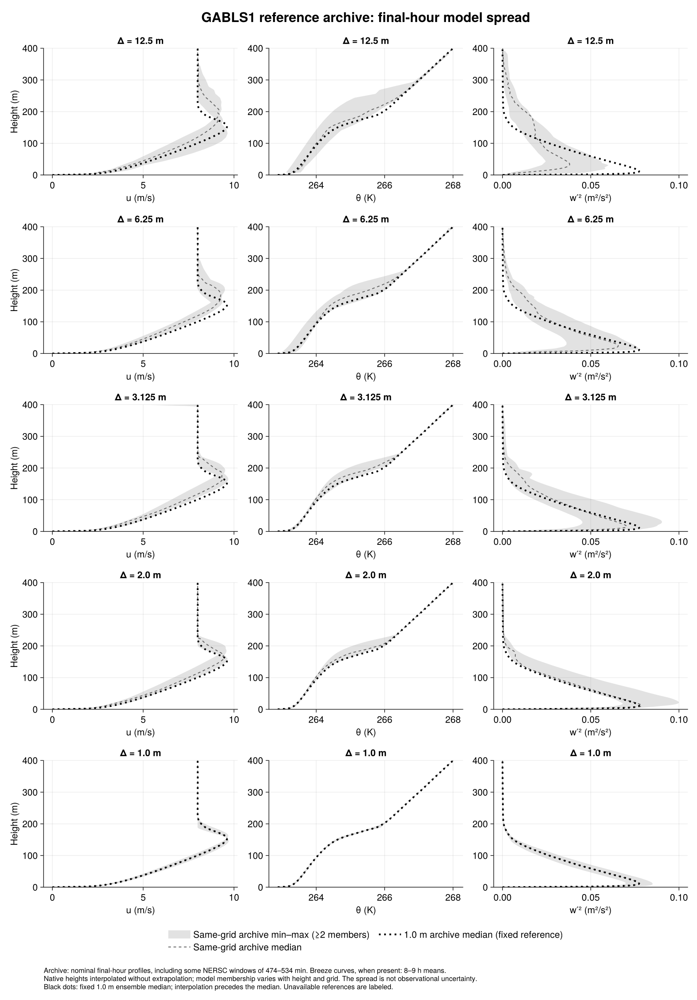

[Vector figure](gabls/figures/reference_overview.pdf)

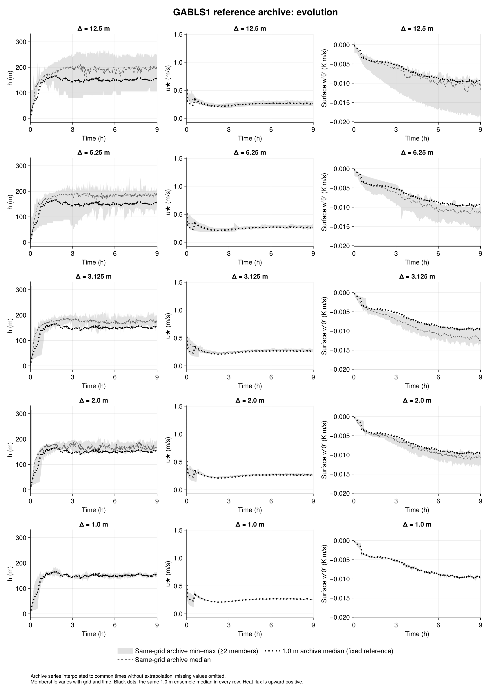

[Vector figure](gabls/figures/reference_evolution.pdf)

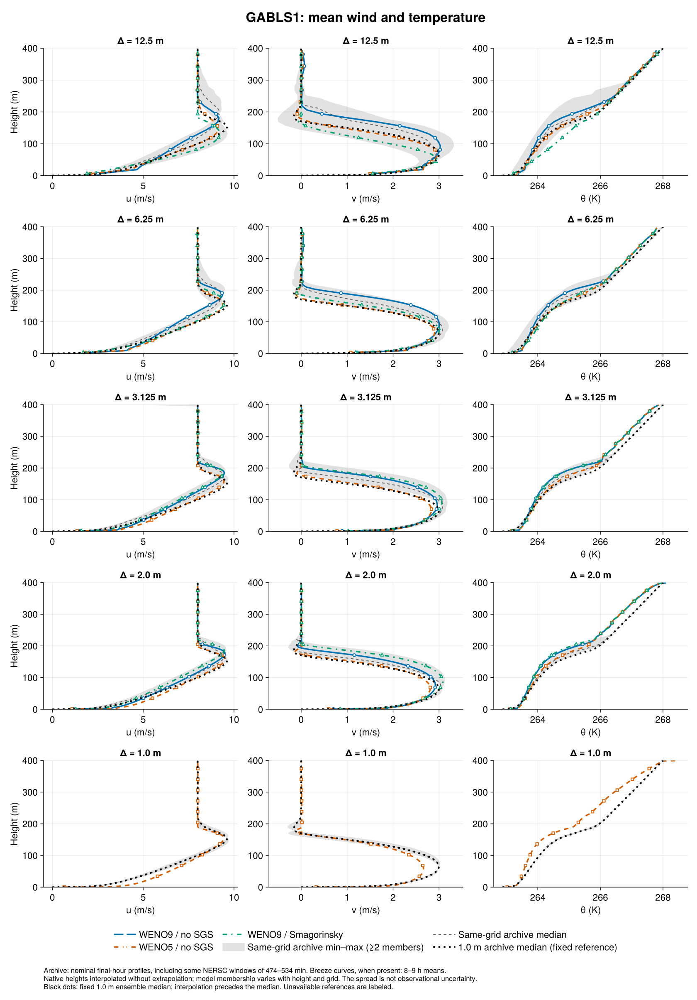

[Vector figure](gabls/figures/mean_profiles.pdf)

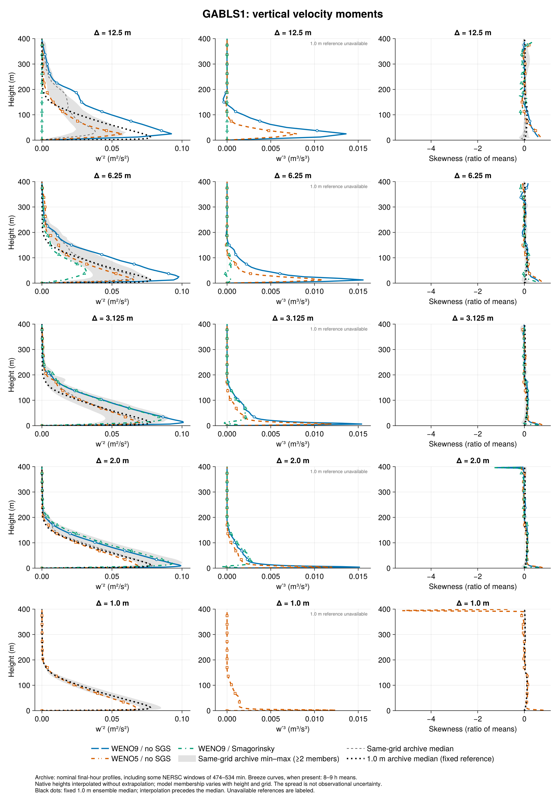

[Vector figure](gabls/figures/vertical_moments.pdf)

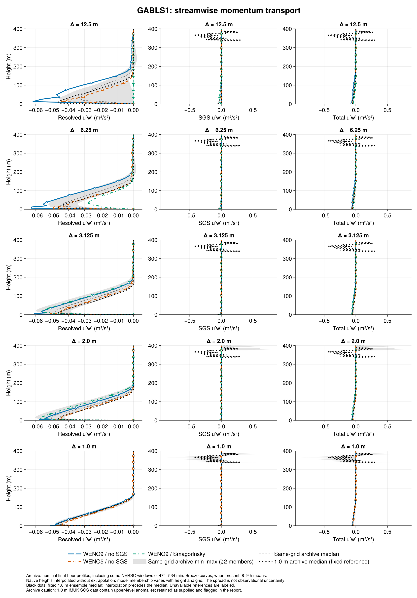

[Vector figure](gabls/figures/momentum_flux.pdf)

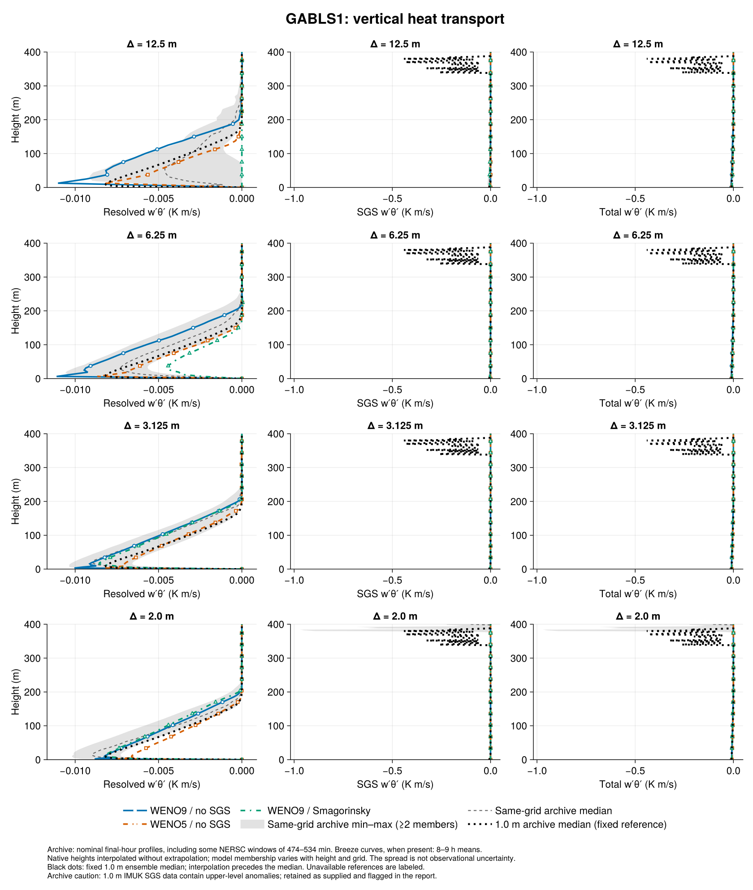

[Vector figure](gabls/figures/heat_flux.pdf)

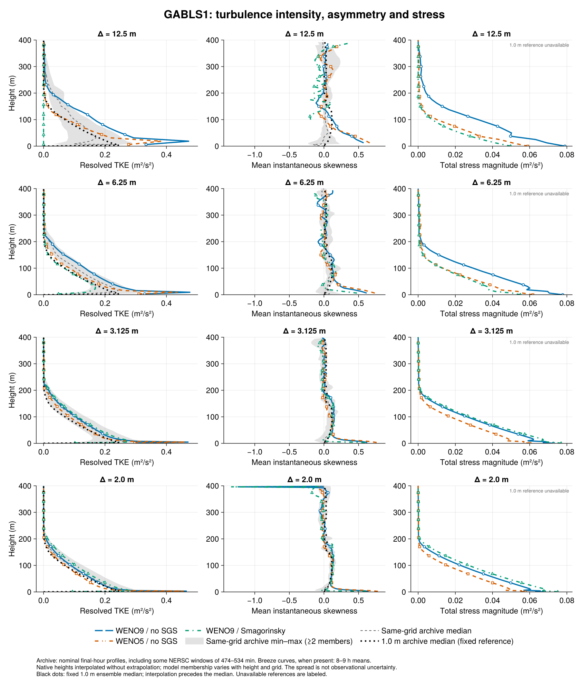

[Vector figure](gabls/figures/tke_skewness_stress.pdf)

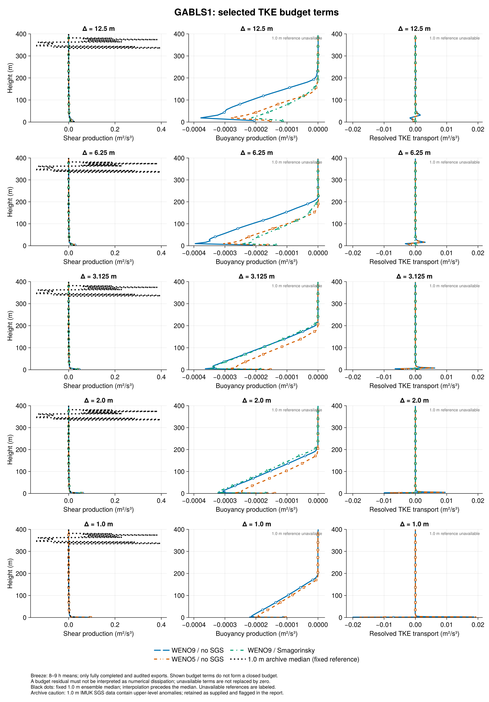

[Vector figure](gabls/figures/tke_terms.pdf)

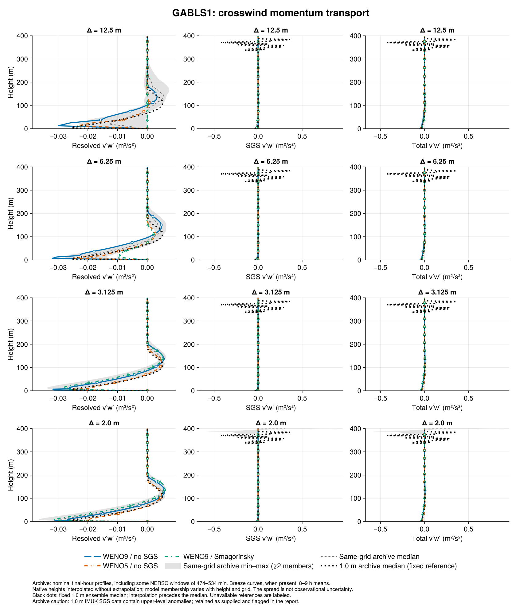

[Vector figure](gabls/figures/crosswind_flux.pdf)

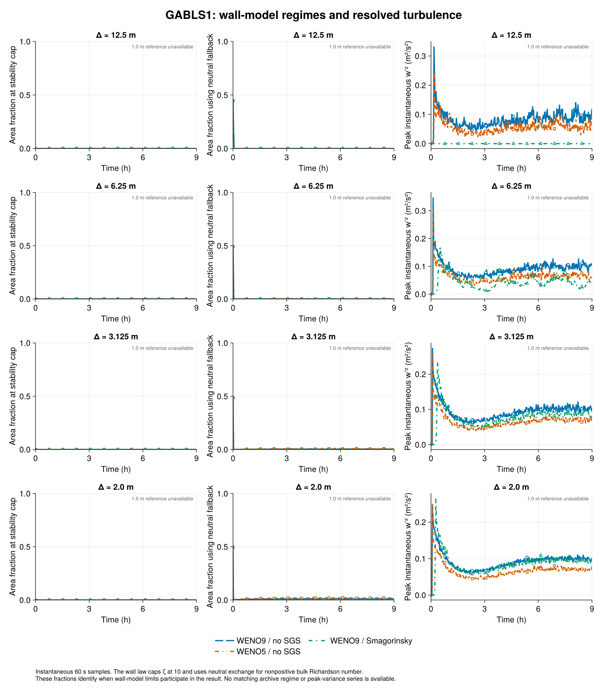

[Vector figure](gabls/figures/surface_regimes.pdf)

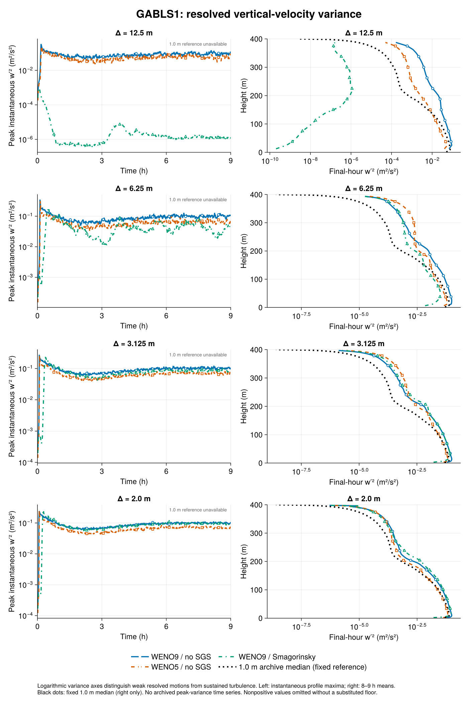

[Vector figure](gabls/figures/resolved_turbulence_decay.pdf)

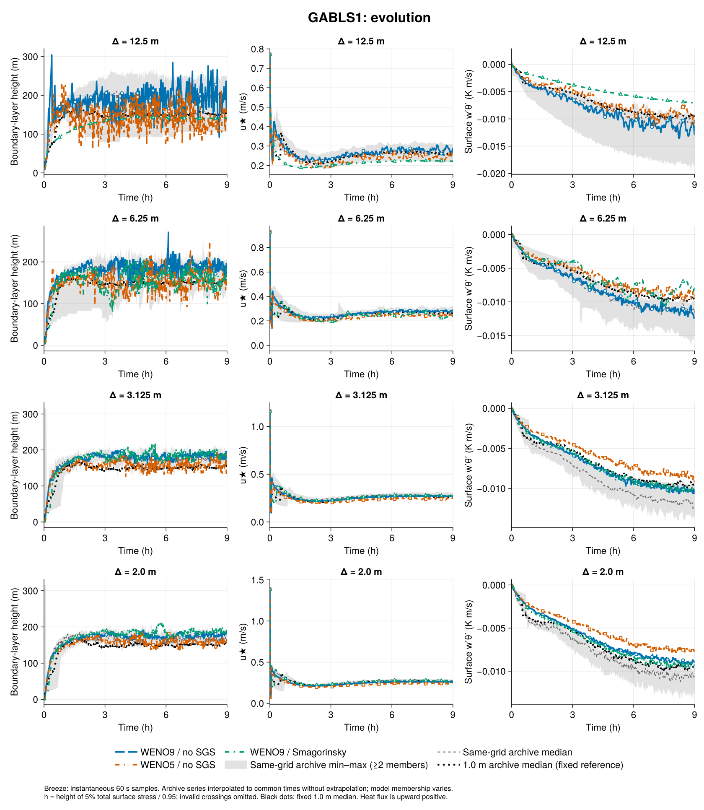

[Vector figure](gabls/figures/evolution.pdf)

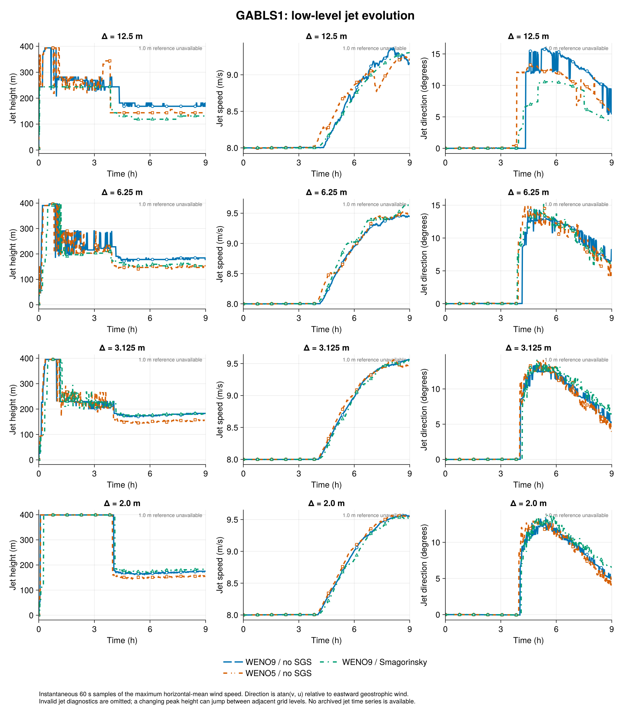

[Vector figure](gabls/figures/jet_evolution.pdf)


---

# Part III: GABLS3

# GABLS3: observational evaluation and case preparation

Status: preparation, with no GABLS3 production results yet. All DYCOMS and GABLS1 material remains in this master report. GABLS1's fixed 1 m ensemble reference is retained in its own comparison.

## Published LES case

The original GABLS3 LES experiment covers 00-09 UTC on 2 July 2006 at Cabauw. It uses an 800 m cube with a common 6.25 m grid. Initial profiles combine tower, wind-profiler and sounding measurements. Geostrophic wind and advective tendencies vary in time and height. Prescribed potential temperature and humidity at 0.25 m replace interactive land-surface and radiation schemes; aerodynamic roughness is 0.15 m. [Basu, Holtslag and Bosveld (2012), sections 2-3](https://www.ecmwf.int/sites/default/files/elibrary/2012/7965-gabls3-les-intercomparison-study.pdf).

For 03-04 UTC, the ensemble reproduced jet height, strength, directional shear and fluxes reasonably well, but near-surface shear was deficient. A 1 m simulation mixed less and produced a stronger jet. Observed submesoscale variability and a turbulence burst were missed. Published LES variances are resolved, whereas observations include total variance. The ensemble percentiles pool models and five-minute samples; tower whiskers show hourly minima/maxima, not confidence intervals. [Basu et al. (2012), sections 4-5 and figures 1-4](https://www.ecmwf.int/sites/default/files/elibrary/2012/7965-gabls3-les-intercomparison-study.pdf).

The related 24-hour SCM experiment begins at noon on 1 July and couples the atmosphere to land-surface and radiation schemes. Its input tables must not silently replace the LES specification. [Bosveld et al. (2014), case selection and setup](https://research.wur.nl/en/publications/the-third-gabls-intercomparison-case-for-evaluation-studies-of-bo-2/).

## Breeze experiment under preparation

Our proposed resolution comparison keeps the 800 m cube fixed: 12.5 m (64 cubed), 6.25 m (128 cubed), and 3.125 m (256 cubed). These nine proposed cases use exactly the user's three configurations: WENO9 without interior closure, WENO5 without interior closure, and WENO9 with Smagorinsky. The added coarse and fine grids are our experiment design, not a claim about the historical intercomparison matrix. Case preparation and validation precede production scheduling; no GABLS3 production run is claimed here.

We will verify the initial profiles, forcing tables, UTC origin, units, moisture convention, roughness lengths, near-surface reference height, wall stability functions through sunrise, damping and perturbations before freezing the setup. Surface exchange remains active in runs without an interior closure. Unresolved parameters stay explicit; GABLS1 defaults cannot substitute for missing GABLS3 inputs.

The comparison will retain observed points and their sampling ranges, published ensemble ranges, and any individual high-resolution LES as distinct references. A single 1 m GABLS3 run is not the two-model GABLS1 median and is not observational truth. Resolution agreement and agreement with observations will be assessed separately.

The author's revised instructions specify instantaneous plane-averaged profiles every five minutes, and surface/point time series every ten seconds. We will preserve that sampling, rather than applying GABLS1 half-hour output averaging. The 0.25 m scalar reference height is distinct from momentum roughness; the wall treatment must handle both stable nighttime and unstable morning conditions. [Revised participant specification, archived in the author's repository](https://github.com/Sukantabasu/jax-alfa/blob/aa7baebf99282711416dadbde7dfdfcba8940524/examples/SBL_GABLS3/GABLS3_LES_Revised.docx).

Planned output includes mean u/v/potential temperature/humidity, velocity variances, vertical-velocity third moment and skewness, resolved/SGS/total momentum, heat and moisture fluxes, available TKE terms, jet height and speed, and surface fluxes, friction velocity and Obukhov length. We will compare the paper's 03-04 UTC interval and the complete night-to-morning evolution. Missing observed third moments or SGS quantities will remain unavailable. Numerical budget residuals will not be labeled dissipation without a closed budget.

Preparation checks cover forcing interpolation and jumps, units, profile shapes, surface fluxes and time stepping. GPU smoke tests retain the two-job limit and GABLS1 priority. Scientific admission requires source/input hashes, completion evidence and audited exports.

## Implementation and validation status: 20 September 2026

The [GABLS3 runner and diagnostics](https://github.com/glwagner/BreezeEvaluation.jl/commit/d21e4a8) are committed. One-second CPU checks passed for the 64 cubed WENO9/no-closure, WENO5/no-closure, and WENO9/Smagorinsky configurations. The WENO9 checks exercised diagnostic writers; the Smagorinsky check produced nonzero explicit heat and moisture fluxes. Native-face vertical-velocity moments retain 65 levels, and centered moisture retains 64. Moist Obukhov length has an explicit validity flag; its zero fallback must be masked when invalid.

Separate CPU fixtures passed six writer checks at exactly 300 s and six morning-event checks, including a callback at exactly 21600 s and the contemporaneous surface humidity. These fixtures initialize the clock just before the event to test scheduling; their states are deliberately nonphysical and are excluded from scientific comparisons. They establish output and callback behavior, not nine-hour stability. The case-local environment still uses a mutable Breeze path during development; an immutable dependency snapshot and bounded GPU validation remain required before scientific runs.

A separate SurfaceLayerDiffusivity study is also authorized: at 12.5 m, a matched WENO9/no-closure control and three treatments (one interior face with 100 s or 300 s filtering, and two faces with 300 s filtering). The same four-case comparison is planned for GABLS1 at 32 cubed and GABLS3 at 64 cubed. This adds a coarse-grid study while retaining the original campaigns. No results from this new closure are available yet. [Implementation and evaluation plan](https://github.com/glwagner/BreezeEvaluation.jl/blob/9ef92a834e62ae8e952757e8c510ae46870f2c95/plans/surface_layer_diffusivity.md).

## Persistent evaluation repository

Created as a private repository: [glwagner/BreezeEvaluation.jl](https://github.com/glwagner/BreezeEvaluation.jl). Migration, GABLS3 preparation and scientific completion are tracked separately. The combined report and all plots use Julia.

The repository now retains the 15 completed DYCOMS and 12 completed GABLS1 cases as audited compact comparison data, alongside case/source snapshots, reference data, Julia plotting/report code, figures and this report. Compact profile subsets are explicitly distinguished from full scientific exports. A hash-verifying restoration workflow recovered all 27 complete profile histories in a separate pcluster analysis copy; the original GABLS1 admission checks accepted all 12 restored cases. Frozen production, failed attempts and raw fields remain on pcluster with checksummed manifests. Original simulation identities and hashes are preserved. Third-party papers are linked.

All analysis and plots use Julia. Existing completed experiments and running GABLS1 jobs continue unchanged during migration. Future evaluations will live in BreezeEvaluation.jl, with their Breeze dependency revision pinned explicitly.
