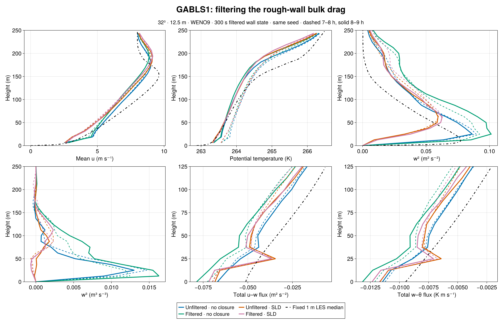
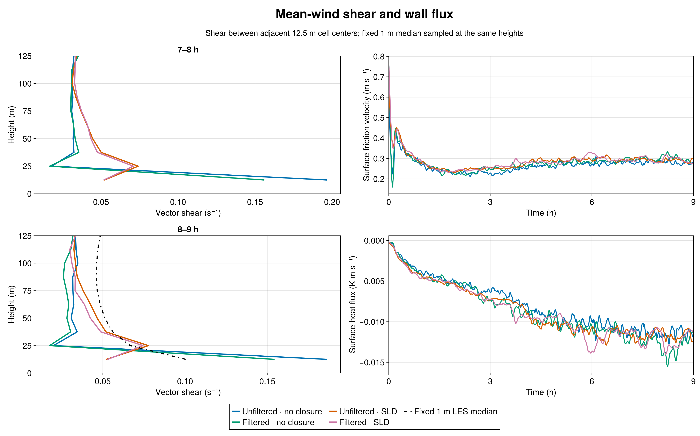
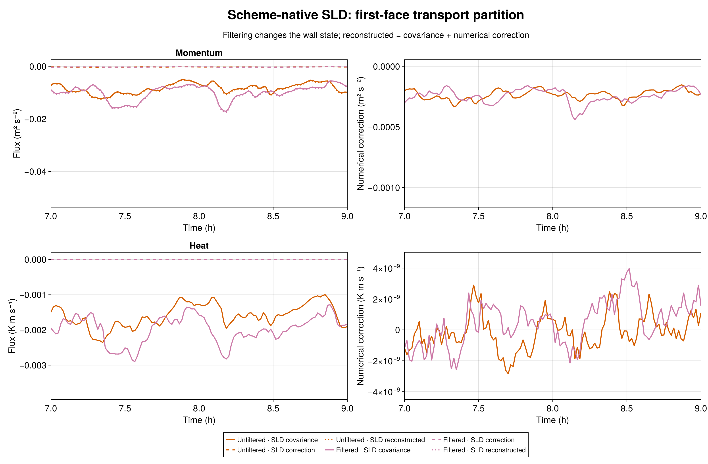
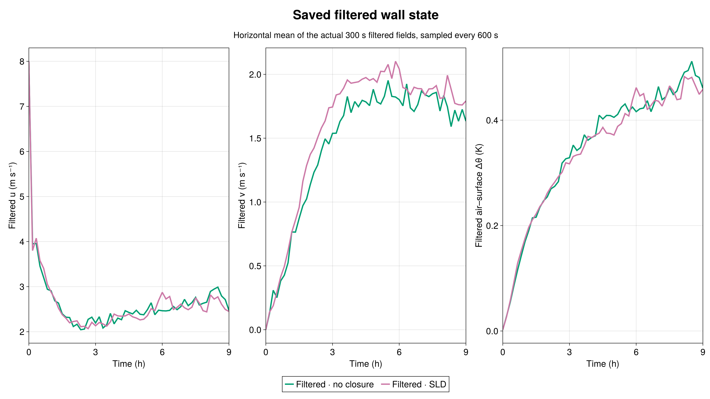

# GABLS1: filtered wall drag with and without scheme-native SLD

Two matched nine-hour, 32³ WENO9 runs test a 300 s temporal filter in the GABLS1 rough-wall bulk-drag law. One has no interior turbulence closure; the other has one-face SurfaceLayerDiffusivity (SLD) using scheme-native WENO transport. Each is compared with its admitted unfiltered counterpart at the same 12.5 m resolution, 400 m domain, forcing, initial-temperature realization, and seed 123. All four curves use Julia-generated figures. The fixed 1 m LES intercomparison median is a reference, not an observation.

**Filtering improves the no-closure first-layer shear but does not repair the SLD shear deficit.** In the 8–9 h mean, vector shear between the 6.25 and 18.75 m velocity levels falls from 0.1861 to 0.1541 s⁻¹ without an interior closure, closer to the 0.1004 s⁻¹ shear computed from the fixed 1 m median u and v profiles. With scheme-native SLD it changes from 0.0522 to 0.0530 s⁻¹, still about half the reference. The same ordering holds in 7–8 h. These are adjacent-center gradients, not wall gradients or medians of member shears.

The filtered no-closure run's final-hour mean friction velocity rises from 0.2794 to 0.3019 m s⁻¹ and its mean kinematic heat flux becomes more negative, −0.01146 to −0.01314 K m s⁻¹. Peak resolved w² rises from 0.0864 to 0.1013 m² s⁻². Filtering also changes the evolving turbulent realization, so the shifts in full profiles cannot be assigned solely to an instantaneous wall-stress difference. The SLD pair changes less in shear (0.0522 to 0.0530 s⁻¹) and peak w² (0.05945 to 0.06276 m² s⁻²). Its mean friction velocity rises modestly from 0.2901 to 0.2949 m s⁻¹. Both SLD profiles still strongly suppress near-wall resolved w² and w³ relative to the no-closure runs. The fixed 1 m archive has no usable w³ median for this panel.

At SLD's first interior face, filtering changes the final-hour mean momentum viscosity only from 1.2958 to 1.2892 m² s⁻¹ and heat diffusivity from 1.2642 to 1.2396 m² s⁻¹. The filtered case's mean WENO numerical correction to u flux is −0.000256 m² s⁻² versus covariance −0.009609 m² s⁻² (2.7%); the heat correction remains approximately zero. Thus filtered wall drag does not make the previously measured small reconstruction correction large enough to explain the SLD shear deficit. This is a one-seed, one-grid sensitivity study, not a universal wall-model calibration.

Both new runs passed the 600 s H100 gate before science. The corrected gate 7536 passed 19/19 no-closure and 21/21 SLD checks. Science array 7537 completed both 32,400 s cases with durable exit zero and `CASE_DONE`. Frozen source manifest SHA-256 is `61a5a464b9d100ff2f302ad822972af9ee47e9340a25bbae0ff597890911367e`; all source-file hashes passed. Both runs record the same initial-theta SHA-256 `1f5db33f2971ee607ac46b1a014b038a09fc876cc1669394dce023a9aa2f198b`. Independent Julia audits verified exact 1/19/541/55 initial/profile/series/filter schedules, finite output, native 32/33-level profiles, evolving saved filtered wall fields, density-consistent momentum and heat surface fluxes, and both 7–8 and 8–9 h windows. For SLD, covariance plus numerical correction equals reconstructed flux at both monitored faces. The first gate 7534 failed only a test case-ID assertion and launched no science; its evidence remains preserved separately.

[Numeric comparison](metrics.md) · [Julia plot source](compare_plot.jl) · [Julia raw audit source](audit_export.jl) · [No-closure audit](export/control/audit.toml) · [SLD audit](export/sld/audit.toml) · [Filtered-wall implementation](https://github.com/glwagner/BreezeEvaluation.jl/tree/glw/sld-filtered-wall-20260922/cases/surface_layer/gabls1)
