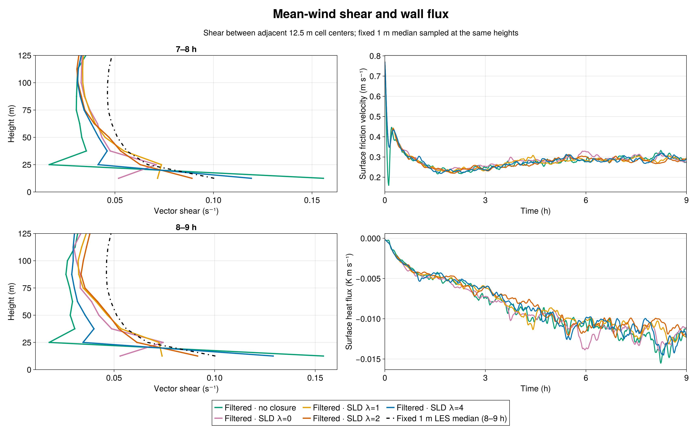
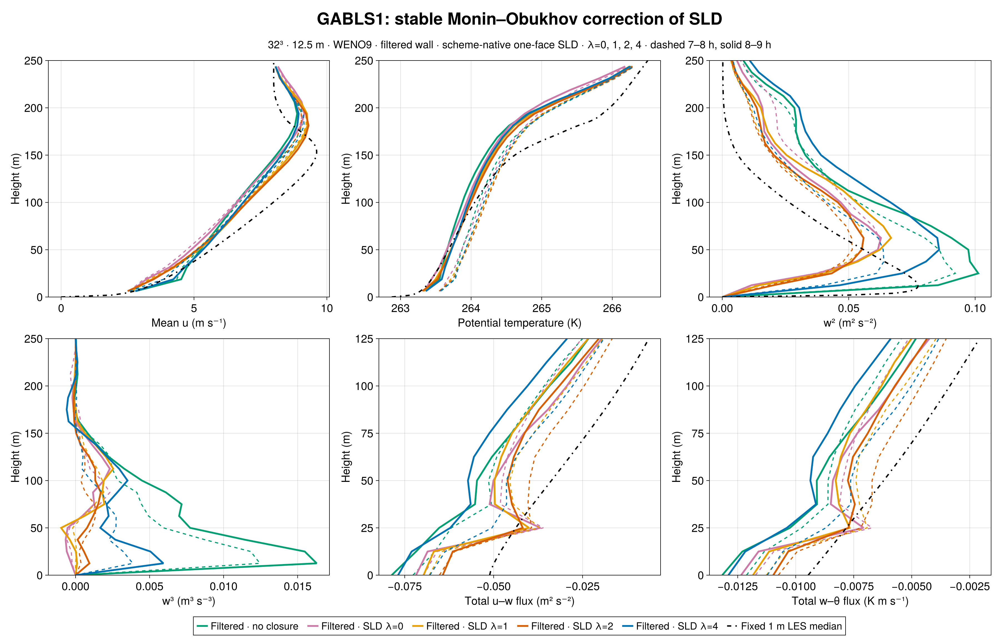
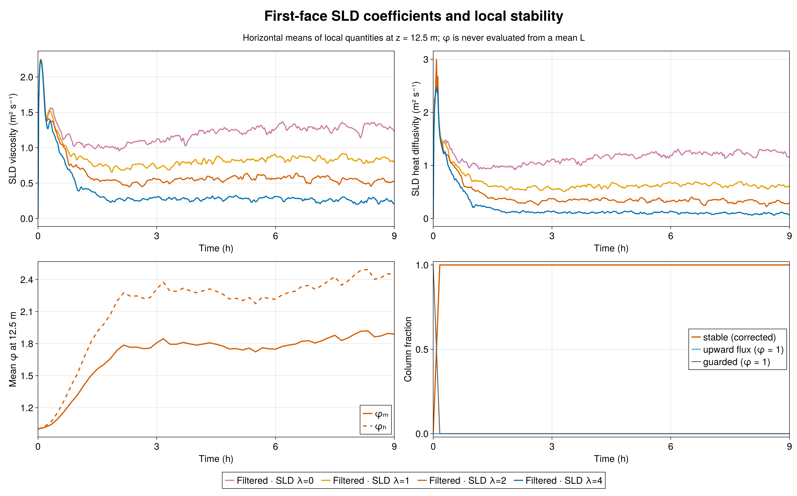
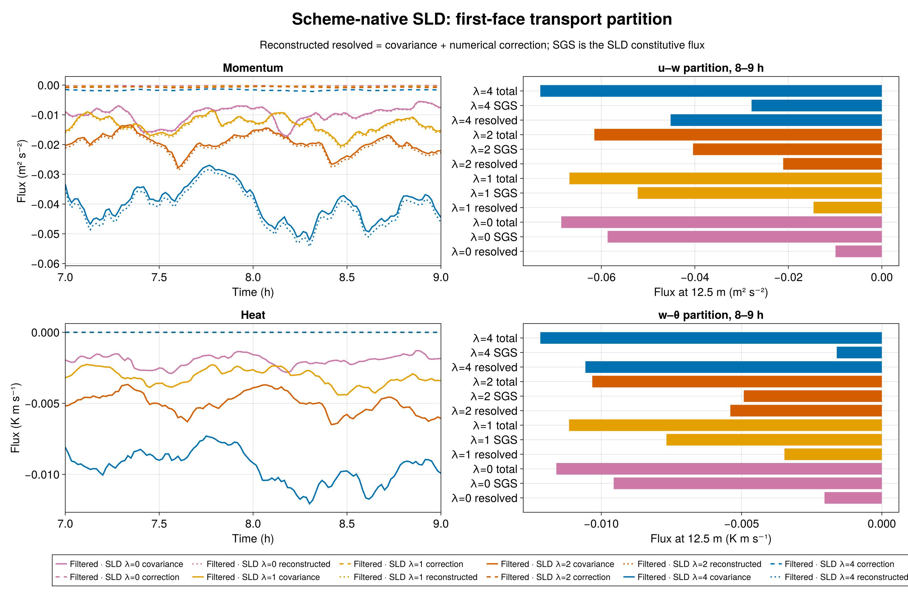

# GABLS1: γ=2 stable SurfaceLayerDiffusivity

The intermediate stability strength **γ=2 removes the γ=4 dip in near-wall shear** in this matched 12.5 m GABLS1 experiment. During 8–9 h, vector shear at 12.5, 25, and 37.5 m is 0.09152, 0.06140, and 0.05235 s⁻¹, decreasing with height. The fixed 1 m LES median sampled at those heights is approximately 0.10038, 0.06666, and 0.05607 s⁻¹. The γ=2 values are closer to the median than γ=1 or γ=4 at the first two heights; this one coarse-grid realization does not establish a universal parameter value.

## Matched experiment

All Breeze curves use the admitted nine-hour GABLS1 setup: a 400 m cube, 32³ cells (12.5 m spacing), WENO9, seed 123, filtered rough-wall drag with a 300 s response, and the same initial potential-temperature field. SLD uses one-face support, a 300 s response, factor-one scheme-native resolved flux, and the same wall law. Only the interior stable-similarity strength γ changes among SLD cases. The wall law already uses stable similarity. In the interior SLD, φₘ=1+γβₘz/L and φₕ=1+γβₕz/L, with βₘ=4.8 and βₕ=7.8. The 1 m median is an LES intercomparison reference, not an observation.

## Shear and turbulence response

First-layer 8–9 h vector shear rises from 0.05302 s⁻¹ at γ=0 and 0.07387 at γ=1 to **0.09152 at γ=2**, compared with 0.12911 at γ=4 and 0.10038 for the median. At 25 m, γ=4 falls to 0.03456 s⁻¹, whereas γ=2 retains 0.06140, close to the reference 0.06666. The γ=2 first-layer shear changes only modestly from 0.08910 in 7–8 h to 0.09152 s⁻¹ in 8–9 h.

Peak resolved w² is 0.05588 m² s⁻² at γ=2 during 8–9 h, below γ=0 (0.06276), γ=1 (0.06676), γ=4 (0.08575), and filtered no closure (0.10125). At 18.75 m, w³ is +9.37×10⁻⁴ m³ s⁻³ at γ=2; γ=4 gives +5.93×10⁻³ and no closure +1.63×10⁻². Thus γ=2 improves this mean-shear profile while leaving resolved turbulence weaker than the γ=4 case. Shear agreement alone is not a complete fidelity measure.

The 8–9 h mean friction velocity is 0.27977 m s⁻¹, versus 0.28907 at γ=1 and 0.29917 at γ=4. The corresponding surface heat flux is −0.010968 K m s⁻¹, versus −0.011838 and −0.012884. Every saved column remains on the stable branch through both final-hour windows; no upward-flux fallback occurs. The 8–9 h mean local first-face φₘ is 1.8930 and φₕ is 2.4512, with median local L=134.7 m.

## Transport partition

At the first interior face, the 8–9 h mean γ=2 momentum viscosity is 0.52303 m² s⁻¹ and heat diffusivity is 0.30073 m² s⁻¹. These lie between the γ=1 values (0.82387, 0.60453) and γ=4 values (0.24517, 0.088672). The evolved resolved u–w flux is −0.021102 m² s⁻² and the SLD u–w flux is −0.040393; the measured WENO numerical correction is −0.00069141 and is reported separately from covariance. Resolved w–θ is −0.0054013 K m s⁻¹ and SLD w–θ is −0.004920. The reduced closure relative to γ=1 shifts transport toward the resolved flow, but much less strongly than γ=4.

## Admission and reproducibility

Breeze implementation commit `b0338bc2921526431763e54caf41675ad062a5d4` and BreezeEvaluation case/audit commit `2e6f2029b416100be17405a586282a7bcd76adda` were frozen with source-manifest SHA-256 `2b873a552acf2781532e55f50236e730b070cedfee3100ab9b71e946dbeace68`. CPU smoke Slurm 7595 passed 48/48 checks. H100 gate 7596 passed CUDA parity 34/34 and the 1,800 s validator 48/48. Nine-hour science Slurm 7615 task 1 ended with durable exit zero and `CASE_DONE final_time_s=32400.0`.

Independent Julia audits verified source hashes, paired initial θ digest `1f5db33f2971ee607ac46b1a014b038a09fc876cc1669394dce023a9aa2f198b`, exact schedules, 46 native-height profiles and 135 series, finite fields, evolving wall and SLD filters, density-consistent wall flux, and scheme-native transport identities. Local 1/L and φ identities passed across 55 saved times through 32,400 s. The [window metrics](metrics.md), [raw-output audit](export/audit.toml), [stability audit](export/stability_audit.toml), [compact data](export/), [Julia figure source](compare_gamma2.jl), and [durable job evidence](evidence/) accompany this chapter. Raw JLD2 and checkpoints remain in `/shared/home/greg/review-coordination/sld-stability-gamma2-20260923/` on pcluster. A paired 64³ grid study follows to test the resolution sensitivity of this apparent improvement.
