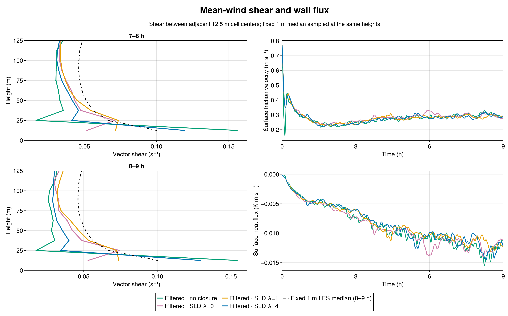
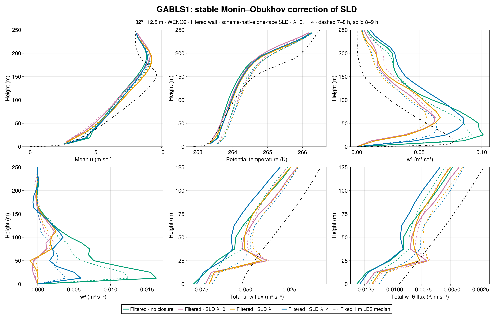
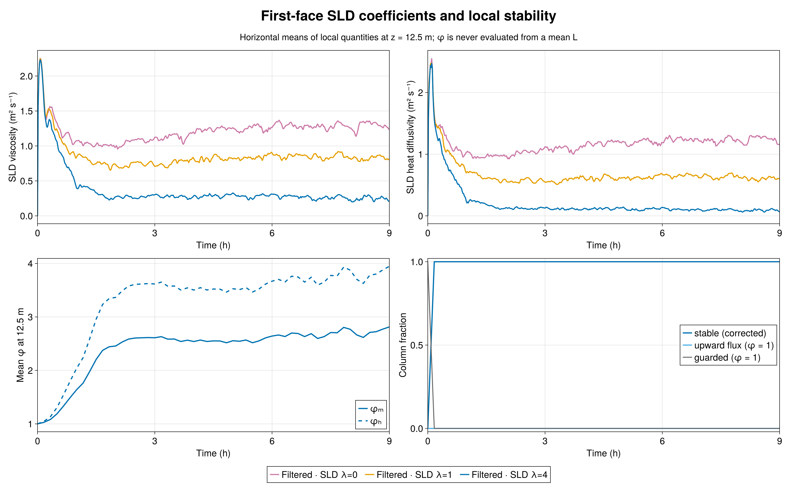
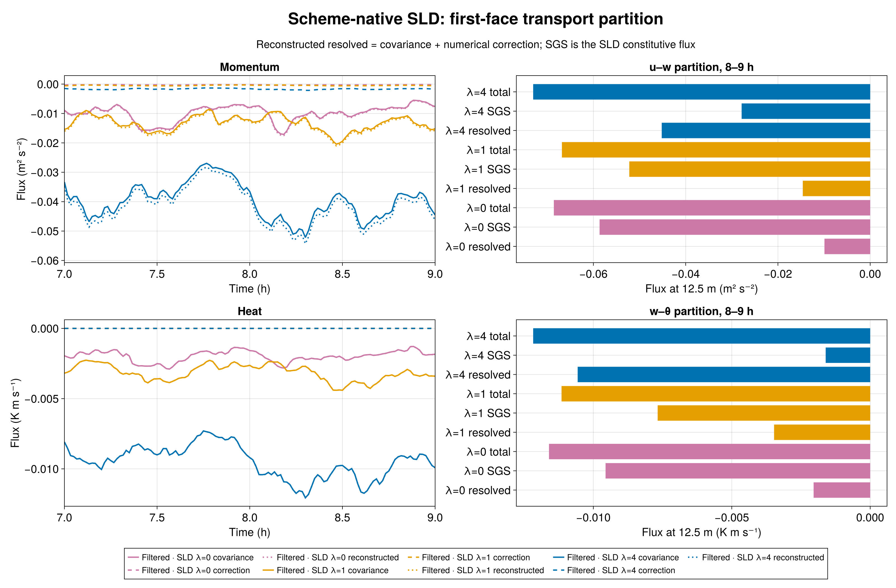

# GABLS1: γ=4 stable SurfaceLayerDiffusivity

Increasing the interior stability strength to **γ=4** substantially restores resolved turbulence in this matched 12.5 m GABLS1 experiment, while **overshooting the first-layer shear** of the fixed 1 m LES median. The 8–9 h vector shear is 0.12911 s⁻¹ for γ=4, compared with 0.05302 for neutral SLD (γ=0), 0.07387 for γ=1, and 0.10038 for the reference median sampled at the same two heights. Filtered wall drag without an interior closure gives 0.15407 s⁻¹. The γ=1 and γ=4 runs bracket the reference and are nearly equally distant from it in shear; these results do not determine a universal optimum.

## Matched configuration

All four Breeze curves use the admitted nine-hour GABLS1 setup: 400 m cube, 32³ cells (12.5 m spacing), WENO9, seed 123, filtered rough-wall drag with a 300 s response, and the same initial potential-temperature field. SLD uses one-face support, a 300 s response, factor-one scheme-native resolved flux, and the same wall law. Only the **interior SLD stability-strength parameter** changes between γ=0, 1, and 4. The wall law already applies stable similarity; γ multiplies the stable interior terms, giving φₘ=1+γβₘz/L and φₕ=1+γβₕz/L with βₘ=4.8 and βₕ=7.8. The 1 m median is an LES intercomparison reference, not an observation or independent truth.

## Turbulence and time-window sensitivity

For 8–9 h, peak resolved w² increases from 0.06276 m² s⁻² at γ=0 and 0.06676 at γ=1 to **0.08575** at γ=4; filtered no-closure gives 0.10125. At 18.75 m, w³ changes from −2.95×10⁻⁴ and +1.02×10⁻⁴ m³ s⁻³ for γ=0 and 1 to **+5.93×10⁻³** for γ=4. Thus the stronger correction recovers much more of the positive turbulent asymmetry shown by the reference profile, although the no-closure value is +1.63×10⁻². The γ=4 values are lower during 7–8 h: peak w²=0.06390 and w³=+3.86×10⁻³, versus 0.08575 and +5.93×10⁻³ during 8–9 h. This growth warns against reading the last hour as a settled equilibrium.

The 8–9 h mean friction velocity is 0.29917 m s⁻¹ at γ=4, compared with 0.29485 for γ=0 and 0.28907 for γ=1. The respective kinematic surface heat fluxes are −0.012884, −0.012333, and −0.011838 K m s⁻¹. At γ=4, every saved column is on the stable branch during both final-hour windows, with no upward-flux fallback. Mean local first-face φₘ=2.7169 and φₕ=3.7900 over 8–9 h; median local L=140.4 m.

## Why the flow changes

The γ=4 first-face momentum viscosity is **0.24517 m² s⁻¹** during 8–9 h, versus 1.2892 at γ=0 and 0.82387 at γ=1. Heat diffusivity falls to **0.088672 m² s⁻¹**, versus 1.2396 and 0.60453. These are measured coefficients from separately evolved LES, not a rescaling of a frozen field. The reduced closure shifts transport toward the resolved flow: first-face resolved u–w changes from −0.014608 at γ=1 to **−0.045186 m² s⁻²** at γ=4, while SLD u–w changes from −0.052218 to **−0.027868**. Resolved w–θ changes from −0.003472 to **−0.010566 K m s⁻¹**, while SLD w–θ changes from −0.007677 to **−0.001608**. The measured WENO numerical correction to the first-face u flux is −0.001743 m² s⁻² at γ=4 and is reported separately from covariance.

The γ=4 response is physically informative, but one seed at one coarse resolution does not establish grid convergence or a transferable calibration. A parameter between γ=1 and 4 might better match this particular mean shear while changing the turbulence moments in another way. The fixed 1 m median itself comes from an LES ensemble rather than field observations.

## Admission and reproducibility

The Breeze implementation is commit `b0338bc2921526431763e54caf41675ad062a5d4`; the γ=4 case and Julia audits are BreezeEvaluation commit `b920375c0038680e3bc127f0c12ac8723ad650c8`. The immutable pcluster freeze has SHA-256 manifest digest `fcfc899821d932861558d0fa55b890da495776b498c17b1279462ca594406e8a`. CPU smoke Slurm 7583 passed 48/48; H100 gate 7584 passed CUDA parity 34/34 and the 1,800 s case 48/48. Nine-hour science Slurm 7585 ended with durable exit zero and `CASE_DONE final_time_s=32400.0`.

Independent Julia audits verified the source hashes, matched initial θ digest `1f5db33f2971ee607ac46b1a014b038a09fc876cc1669394dce023a9aa2f198b`, exact schedules, 46 native-height profiles and 135 series, finite fields, evolving filters, density-consistent wall flux, and scheme-native transport identities. Local 1/L and φ identities passed across 55 saved times through 32,400 s. The [window metrics](metrics.md), [raw-output audit](export/audit.toml), [stability audit](export/stability_audit.toml), [compact data](export/), [Julia figure source](compare_gamma4.jl), and [durable job evidence](evidence/) accompany this chapter. Raw JLD2 and checkpoints remain in `/shared/home/greg/review-coordination/sld-stability-gamma4-20260923/` on pcluster. All earlier report evidence is retained.
