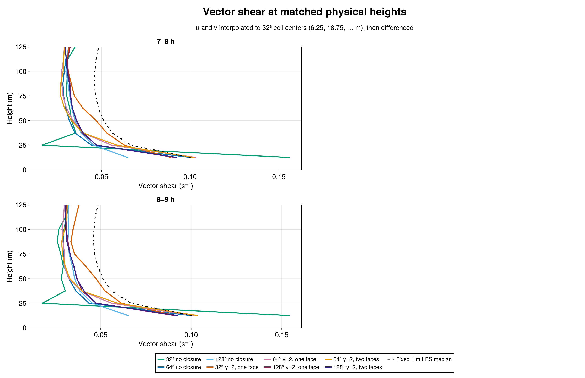
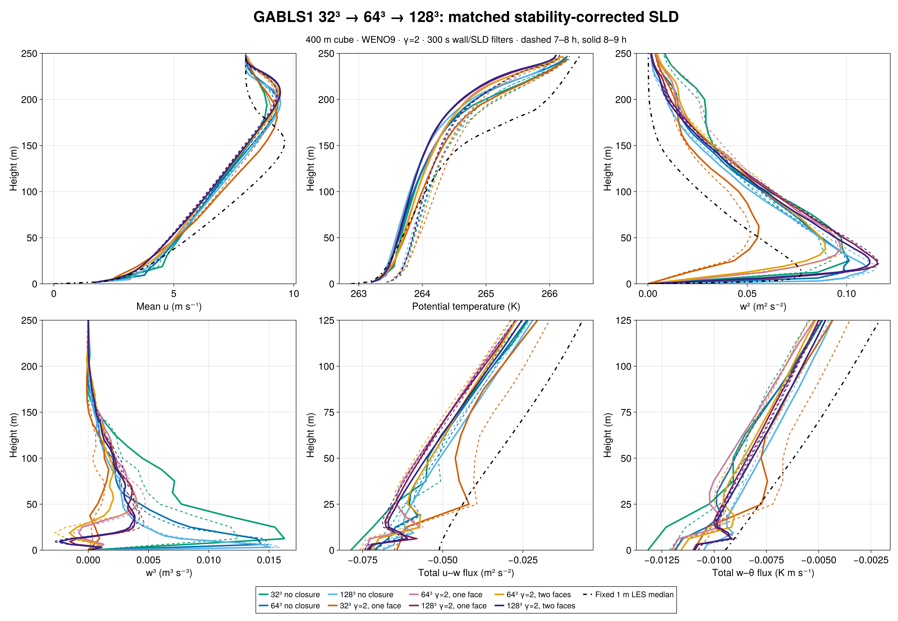

# GABLS1 resolution sensitivity: 32³, 64³, and 128³

The matched 128³ runs do **not** establish grid convergence of the γ=2 SurfaceLayerDiffusivity (SLD) solution. During 8–9 h, one-face SLD vector shear on common 12.5 m intervals is 0.09152/0.06140/0.05235 s⁻¹ at 32³, 0.10144/0.05600/0.03951 s⁻¹ at 64³, and 0.09080/0.04759/0.03967 s⁻¹ at 128³ (at heights 12.5/25/37.5 m). The fixed 1 m LES intercomparison median is 0.10038/0.06666/0.05607 s⁻¹. The 128³ two-face case gives 0.09242/0.04739/0.04083 s⁻¹. Its second face has little effect on shear above 12.5 m. The final two one-face grids nearly agree at 37.5 m, but both remain well below the median there and disagree at the lower heights.

## What was held fixed

All runs use the 400 m GABLS1 cube, WENO9 advection, seed 123, the same coarse perturbation realization prolonged to each grid, filtered rough-wall drag, and 300 s wall and SLD response filters. The SLD cases use scheme-native advective reconstruction, factor one, and stable-similarity strength γ=2. The 128³ spacing is 3.125 m. Three 128³ cases were run for nine simulated hours: filtered no closure, γ=2 one-face SLD, and γ=2 two-face SLD. The two preceding grids use matched configurations. The fixed 1 m median is an LES intercomparison reference, **not an observation or universal truth**.

One-face SLD reaches z=12.5/6.25/3.125 m at 32³/64³/128³. Two-face SLD reaches z=12.5 m at 64³ and only z=6.25 m at 128³. The implementation supports at most two faces, so **none of the 128³ runs retains the 12.5 m physical support** of 32³ one-face or 64³ two-face SLD. Refinement here changes both grid spacing and the closure's physical reach. The three-grid trend is valuable but is not a formal convergence demonstration or a fixed-support test.

To compare shear, u and v are each interpolated to 32³ cell centers before computing vector differences across the same 12.5 m intervals. [Native-grid shear](figures/n128_native_shear.png) is shown separately because its intervals differ by grid. Both 7–8 h and 8–9 h windows appear in the figures and [complete metrics](metrics.md).

## Turbulence and transport

At 8–9 h the 128³ no-closure shear is 0.06509/0.04539/0.03847 s⁻¹, while the 128³ one-face SLD shear is 0.09080/0.04759/0.03967 s⁻¹. SLD improves the first interval but barely changes the next two. Peak resolved w² is 0.11063 m² s⁻² without closure, 0.11556 with one face, and 0.11171 with two faces. By comparison the 32³ one-face peak is 0.05588 and the 64³ one-face peak is 0.09688 m² s⁻². Resolved turbulence therefore remains substantially grid-sensitive. At 18.75 m, interpolated w³ for the 128³ one- and two-face cases is +0.002489 and +0.002144 m³ s⁻³, versus negative values at 64³. The fixed 1 m archive has no w³ median; the sign change is a sensitivity result, not a fidelity ranking.

During 8–9 h, friction velocity is 0.28526 m s⁻¹ for 128³ no closure, 0.29801 for one-face SLD, and 0.29644 for two-face SLD. The corresponding surface heat fluxes are −0.01049, −0.01100, and −0.01093 K m s⁻¹. [Wall histories and transport partition](figures/n128_wall_transport.png) show these alongside the 32³ and 64³ cases. At 128³ face 2 (z=6.25 m), the two-face mean momentum viscosity is 0.04693 m² s⁻¹, resolved u–w flux is −0.05477 m² s⁻², SGS u–w flux is −0.00619 m² s⁻², and the independently reported WENO correction is −0.01079 m² s⁻². The corresponding 64³ second face lies at z=12.5 m, so its transport partition is not a same-height comparison.

## Admission and reproducibility

The immutable 128³ simulation freeze is `/shared/home/greg/review-coordination/sld-gabls1-n128-freeze-20260923-v1`: BreezeEvaluation simulation commit `27261b313409d81cf7164bbf519970bc60b50e6f`, Breeze commit `b0338bc2921526431763e54caf41675ad062a5d4`, full source-manifest SHA-256 `dfdcd8846a756b73b7006b67a0bdcd565a2df5400bf769e64f9d7d5345e3e233`. H100 gate 7674 passed CUDA parity 34/34 and 600 s validators 15/15 (no closure), 32/32 (one face), and 38/38 (two faces). Science Slurm array 7688 tasks 1–3 each reached `CASE_DONE final_time_s=32400.0` and durable exit zero. Independent Julia audits admitted all three exports: source and paired initial state, native 128/129 heights, exact sampling times, finite fields, evolving wall filter, surface flux and scheme-native transport identities. Both SLD cases passed 55 saved local 1/L and similarity-factor records through nine hours. An audit-only copied face-2 height was corrected to 6.25 m before admission; the frozen simulation source was unchanged. The [compact exports](export/), [figure source](compare_n128.jl), [data auditor](audit_export_n128.jl), [corrected stability auditor](audit_stability_n128.jl), and [durable evidence](evidence/) accompany this chapter. Full JLD2 histories and checkpoints remain in the pcluster campaign.
