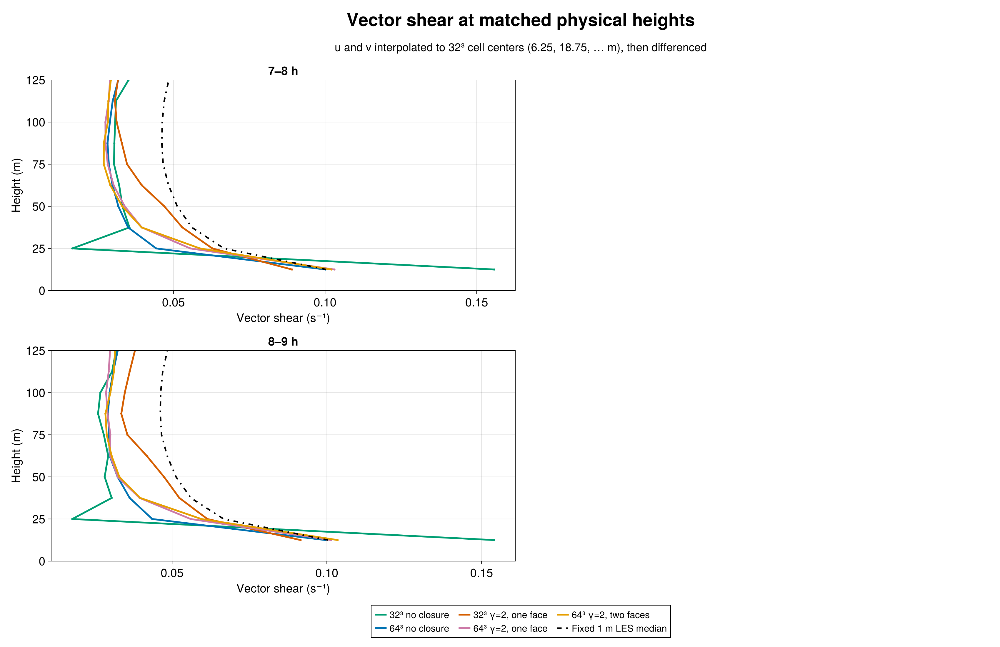
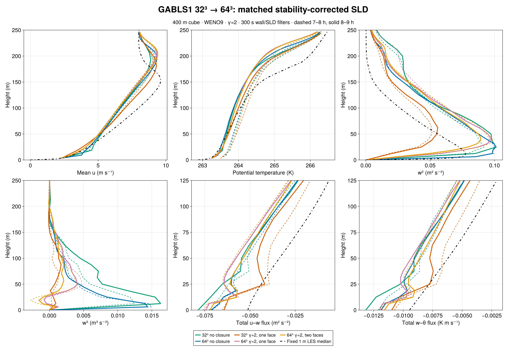

# GABLS1 resolution sensitivity: 32³ and 64³

The matched 64³ runs show a substantial grid response, especially in resolved turbulence. At 8–9 h, the 64³ γ=2 one-face SLD case has vector shear of **0.10144, 0.05600, and 0.03951 s⁻¹** at 12.5, 25, and 37.5 m on a common physical-height grid. The fixed 1 m LES median sampled at those heights is **0.10038, 0.06666, and 0.05607 s⁻¹**. A second SLD face changes the 64³ shears to **0.10348, 0.05945, and 0.03972 s⁻¹**. It modestly improves agreement at 25 m, but neither 64³ SLD case recovers the median shear at 37.5 m. These two grids show sensitivity, not established convergence.

## Matched cases and interpretation

The 32³ and 64³ cases use the same 400 m cube, WENO9 advection, GABLS1 forcing, seed 123, filtered rough-wall drag with a 300 s response, and paired initial potential-temperature perturbations. The 64³ grid spacing is 6.25 m. We compare filtered no closure, γ=2 scheme-native SLD with one face, and γ=2 scheme-native SLD with two faces. SLD uses factor-one reconstructed flux and a 300 s filter. The 32³ one-face and 64³ two-face cases both reach the physical height 12.5 m; the 64³ one-face case acts only at 6.25 m. This support-height change must be considered alongside grid refinement. The fixed 1 m median is an LES intercomparison reference, not an observation.

Shear was computed after interpolating the **u and v mean profiles** to the 32³ cell-center heights, then differencing over the common 12.5 m intervals. [Native-grid shear](figures/n64_native_shear.png) is shown separately. Both 7–8 h and 8–9 h windows appear in the figures; full values are in the [metrics table](metrics.md).

## Shear, moments, and fluxes

At 12.5 m, the filtered no-closure shear changes from 0.15407 s⁻¹ at 32³ to 0.09953 s⁻¹ at 64³, nearly matching the median 0.10038 s⁻¹. But the 64³ no-closure shear at 25 and 37.5 m remains low (0.04359 and 0.03629 s⁻¹ versus median 0.06666 and 0.05607). The 32³ γ=2 one-face values are 0.09152, 0.06140, and 0.05235 s⁻¹. At 64³, the one-face case improves the 12.5 m value but loses agreement farther above the wall. The two-face case restores some 25 m shear without materially changing the 37.5 m result.

Peak resolved w² in the 8–9 h window rises from 0.05588 m² s⁻² in the 32³ γ=2 one-face case to 0.09688 m² s⁻² at 64³ one face and 0.08933 m² s⁻² at 64³ two faces; the matched 64³ no-closure value is 0.10113 m² s⁻². At 18.75 m, interpolated w³ changes from +0.000752 m³ s⁻³ at 32³ one face to −0.000777 and −0.001543 m³ s⁻³ at 64³ one and two faces. The fixed 1 m reference archive has **no w³ median**, so this change is a sensitivity finding, not a fidelity ranking. The 7–8 h window gives similar near-wall shear but somewhat different moments, particularly for the two-face w² peak (0.09876 versus 0.08933 m² s⁻² in 8–9 h).

Surface friction velocity is 0.27977 m s⁻¹ for the 32³ one-face case and 0.29767 / 0.29288 m s⁻¹ for the 64³ one- / two-face cases in 8–9 h. Surface heat flux is −0.01097, −0.01203, and −0.01158 K m s⁻¹ respectively. The [wall and transport figure](figures/n64_wall_transport.png) shows the time histories and resolved/SGS partition. At the common physical face z=12.5 m, 64³ two-face momentum viscosity is 0.09525 m² s⁻¹, whereas 32³ one-face viscosity is 0.52303 m² s⁻¹. The 64³ two-face resolved u–w flux is −0.04946 m² s⁻² and SGS u–w is −0.00776 m² s⁻². Its measured WENO correction is −0.01178 m² s⁻², reported separately from the covariance. These values demonstrate that matching the physical support height does not make the transport partition grid-independent.

## Admission and reproducibility

The immutable 64³ source freeze is `/shared/home/greg/review-coordination/sld-gabls1-n64-freeze-20260923-v2`, with BreezeEvaluation simulation commit `82fbf14252eadcd198abb8d18a38555939b5df91`, Breeze commit `b0338bc2921526431763e54caf41675ad062a5d4`, and source-manifest SHA-256 `19f41d02f5bd249fe32a5edf2d8956e9886b1f58347a98907ec83b1c23d0fbd7`. Gate Slurm 7627 passed CUDA parity 34/34, no-closure validation 15/15, one-face 32/32, and two-face 38/38. Nine-hour science array 7640 tasks 1–3 reached `CASE_DONE final_time_s=32400.0` with durable exit zero. Independent frozen Julia auditors admitted native 64/65-level profiles, exact sampling schedules, paired initial digest, finite fields, wall-filter evolution, density-consistent surface flux, and scheme-native flux identities. Both SLD runs passed 55 local stability records through 32,400 s, including face-two φ and 1/L identities. The [compact audited exports](export/), [figure source](compare_n64.jl), [audit source](audit_export_n64.jl), [stability audit source](audit_stability_n64.jl), and [durable evidence](evidence/) accompany the chapter. Full raw JLD2 files and checkpoints remain in the pcluster campaign.

A paired 128³ extension is prepared to test whether these differences continue to shrink or change sign. The current SLD implementation supports at most two faces: at 128³ its two-face support reaches only 6.25 m, so a fixed 12.5 m support comparison would require separate implementation work.
