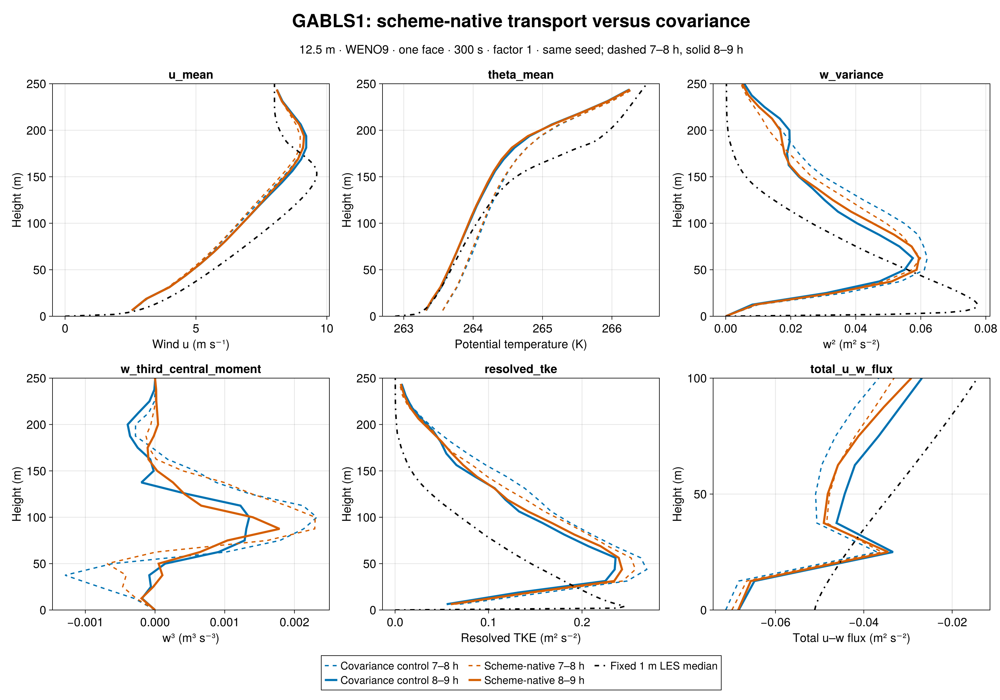
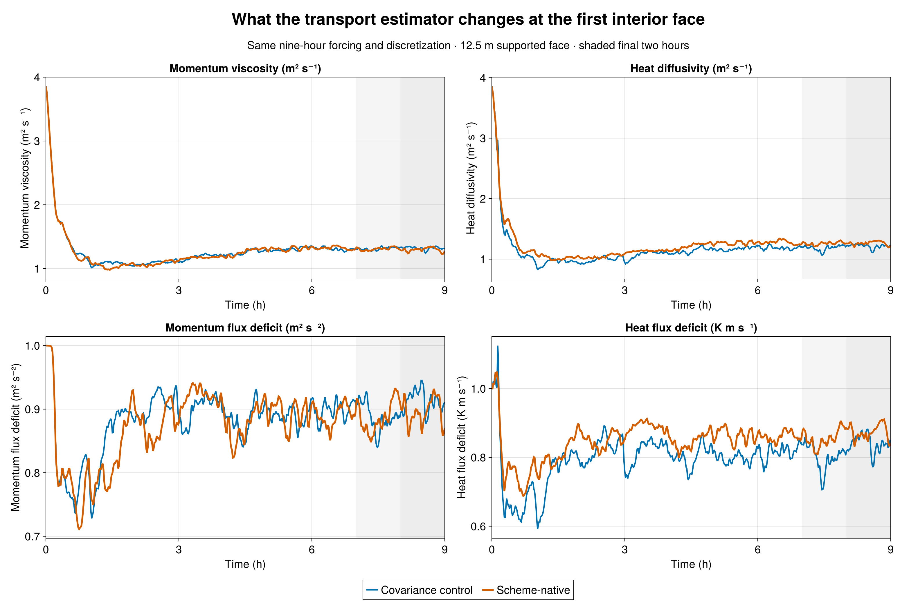
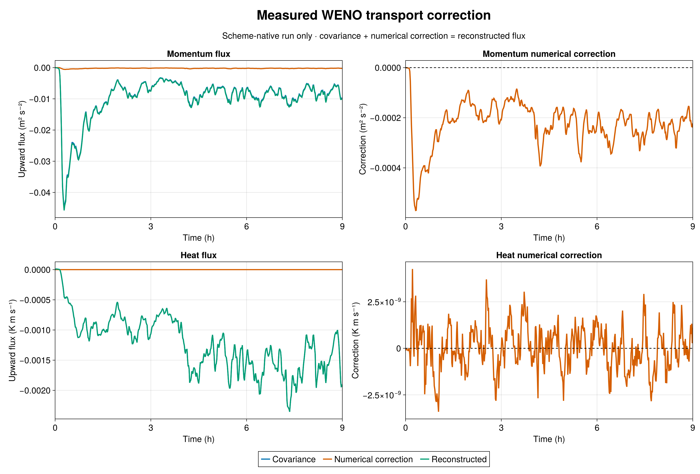

# Scheme-native WENO transport in GABLS1

The matched 12.5 m GABLS1 experiment is complete. Both runs use a 32³ grid in a 400 m cube, WENO9, one interior closure face, a 300 s filter, factor one, seed 123, and nine hours of identical forcing. The new run changes only the closure's estimate of resolved transport: it uses the materialized WENO advective flux, including its numerical correction, rather than the filtered covariance alone. The earlier admitted factor-one run is the control.

At the first interior face, the measured 8–9 h WENO correction to upward u-momentum transport is **−0.000228 m² s⁻²**, versus a covariance of **−0.007749 m² s⁻²**: about **2.95%** of the covariance. The mean heat correction is **1.4 × 10⁻¹⁰ K m s⁻¹**, effectively zero relative to its **−0.001472 K m s⁻¹** covariance. The saved correction and covariance add to the reconstructed flux at both diagnostic faces for momentum and scalars. This direct measurement gives no support, in this case, for treating missing numerical flux as equal to or twice the covariance—the assumptions behind the earlier factors two and three.

The closure and flow change modestly over the final hour. Mean first-face momentum viscosity decreases from **1.3214** to **1.2958 m² s⁻¹** (−1.9%); heat diffusivity rises from **1.2160** to **1.2642 m² s⁻¹** (+4.0%). Integrated resolved TKE rises 3.8%, the peak resolved w² rises 3.1%, and the diagnosed boundary-layer height falls 7.4 m (3.8%). These are paired single-realization differences after nine hours of evolving turbulence, not estimates of systematic numerical error. The directly measured numerical correction is much smaller than the covariance, and some flow differences may reflect trajectory divergence.

Both 7–8 h and 8–9 h profiles are shown at native model heights against the fixed 1 m LES median where available. Mean wind, temperature, w², w³, resolved TKE, and total u–w flux show that the scheme-native run remains close to the factor-one control. Both coarse SLD runs still depart markedly from the fixed 1 m LES reference in resolved turbulence; the reconstruction change alone does not repair that discrepancy. The 1 m median is a model intercomparison reference, not an observation.

The science job **7497** completed at 32,400 s with durable exit zero. Frozen Breeze/Evaluation source passed all 792 hash checks (manifest SHA-256 `72f1bc031503f0833a1b6969e29e2078ceef04e495b8e27cc3885a9843e35a25`); the paired initial-theta SHA-256 is `1f5db33f2971ee607ac46b1a014b038a09fc876cc1669394dce023a9aa2f198b`. Raw JLD2 audit passed exact 1/19/541 initial/profile/series schedules, native 32/33-level profiles, finite values, and covariance-plus-correction identities on both faces. The comparison uses the previously admitted factor-one output; that run was not repeated. Julia generated all figures.

[Julia JLD2 audit and export](audit_export.jl) · [Julia plotting and comparison](compare_plot.jl) · [Audit manifest](export/audit.toml) · [Full metrics](comparison_metrics.md)
