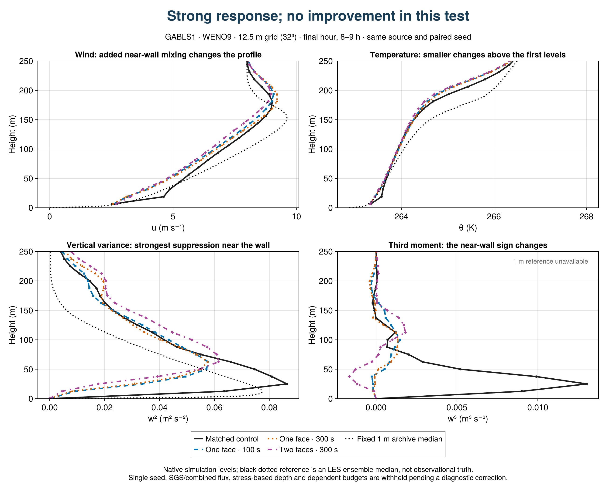
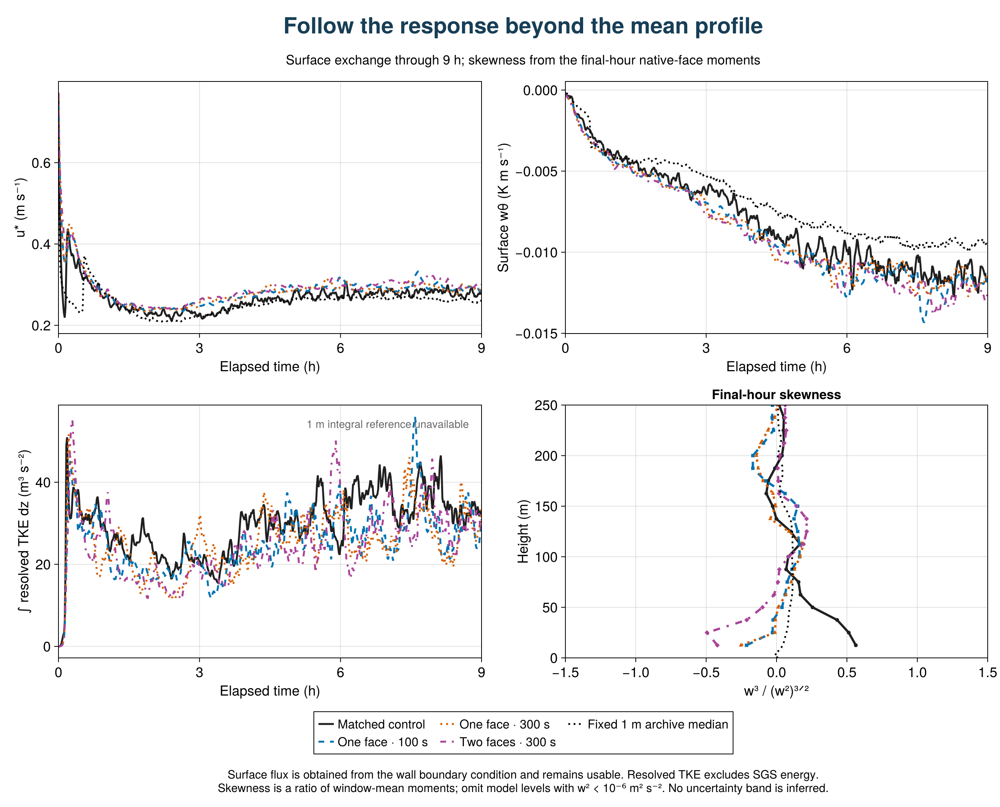

## SurfaceLayerDiffusivity: strong response, no improvement in this coarse GABLS1 test

**The closure changes the near-wall turbulence substantially, but these three configurations do not improve agreement with the fixed 1 m LES median on the profile measures tested.** This is a preliminary result from four completed, paired 9 h runs at 12.5 m resolution (32³ cells, 400 m cube), all using WENO9 and the same frozen model source. It is not a conclusion about all resolutions or stable boundary layers.

[Vector figure](figures/sld_physical_response.pdf)

### What changes?

At the first interior face, z = 12.5 m, final-hour w² falls from 0.0635 m²/s² in the control to 0.00924, 0.00817 and 0.00451 m²/s² with the one-face/100 s, one-face/300 s and two-face/300 s closures: reductions of **85%, 87% and 93%**. The fixed 1 m median at this height is about 0.0774 m²/s². Domain-integrated resolved TKE falls by 18%, 20% and 15%, respectively. The much larger local decrease demonstrates that the response is concentrated near the wall.

At the same face, w³ changes from +0.00902 m³/s³ to small negative values. Skewness changes from +0.56 to −0.21, −0.25 and −0.42. The sign describes asymmetry in vertical motions, not an improvement score. The archive has no directly comparable w³ reference; its available skewness reference is shown separately.

### Does it agree better with the reference?

For the final hour, RMS discrepancies from the fixed 1 m median over native model levels in 0 < z ≤ 200 m are:

| Configuration | Mean u (m/s) | Mean θ (K) | w² (m²/s²) |
|---|---:|---:|---:|
| Matched control | 0.715 | 0.372 | 0.0160 |
| One face / 100 s | 1.009 | 0.431 | 0.0240 |
| One face / 300 s | 0.938 | 0.418 | 0.0245 |
| Two faces / 300 s | 1.147 | 0.463 | 0.0302 |

The reference median is linearly interpolated to the native simulation levels for this descriptive calculation; the simulation profiles themselves are not interpolated. The reference is an ensemble of LES, not observational truth. These are unweighted profile errors, not statistical significance tests or a combined ranking.

Final-hour u* increases from 0.279 m/s in the control to 0.292, 0.289 and 0.301 m/s, while the reference average is 0.262 m/s. The surface cooling flux becomes more negative, moving farther from the reference as well. The one-face 100 s and 300 s runs give similar near-wall responses; extending support to two faces strengthens the variance suppression. The direction of the near-wall variance, skewness, surface-drag and resolved-energy changes is also present in the preceding hour, although magnitudes differ. A single seed and two adjacent windows do not establish sampling uncertainty.

[Vector figure](figures/sld_exchange_and_skewness.pdf)

### A diagnostic limitation that matters

**Do not use the exported SGS flux, combined flux, stress-based depth, or dependent SGS/combined production terms from this attempt for physical conclusions.** The first review found zero reported SGS flux despite nonzero closure coefficients. The diagnostics call the flux path for the model's vertically implicit time discretization; that path omits the implicit contribution. GABLS3 shares the helper. This is a diagnostic problem and does not mean that the closure supplied no transport in the model.

The plots above use mean fields, resolved moments, resolved energy and direct wall exchange. Their values do not depend on the omitted SGS-flux diagnostic. No inference about a collapsed boundary-layer depth is made. The original exports and initial admission records are retained unchanged, accompanied by an explicit [diagnostic exclusion record](diagnostic_exclusions.md). Successful file/shape/hash validation was insufficient to establish flux semantics. A nonzero implicit-flux regression is being added before a corrected transport comparison is admitted. Reduced averages cannot reconstruct exact averages of coefficient–gradient products.

### Reproduce and extend

The final-hour profiles average the two true half-hour windows ending at 30600 and 32400 s. Surface/energy statistics use 60 instantaneous samples at 28860:60:32400 s. Skewness is the ratio of window-mean third moment to variance raised to 3/2; levels with w² < 10⁻⁶ m²/s² are omitted in its plot. The preceding-hour sensitivity uses bins ending at 27000 and 28800 s.

[Julia figure and analysis source](present_results.jl) · [Exact metrics, definitions and hashes](physical_response_summary.json) · [Physical summary table](physical_response_table.md) · [Original export collection](collection_0bfa03d/manifest.toml)

Breeze source: `02a16478869abf556a464f0874925510bb7c233c`; scientific evaluation source: `9fb39dc8b82cd20559b2a74dfa9545dcf395c4c6`; export analysis: `0bfa03d0ce2df07faaa14d22e3f59b3d1e06c66d`. Four-case array: `7156`. Full GPU harness passed 1,678 checks on the source used for these runs; that does not override the later diagnostic exclusion.

The next evidence needed is a correct explicit-plus-implicit transport comparison, followed by the matched GABLS3 transfer test and the bounded neutral-flow check. The present result is a reason to investigate the closure's strength and support, not to tune it to one aggregate metric. Original DYCOMS and GABLS1 studies are retained in the master report.
