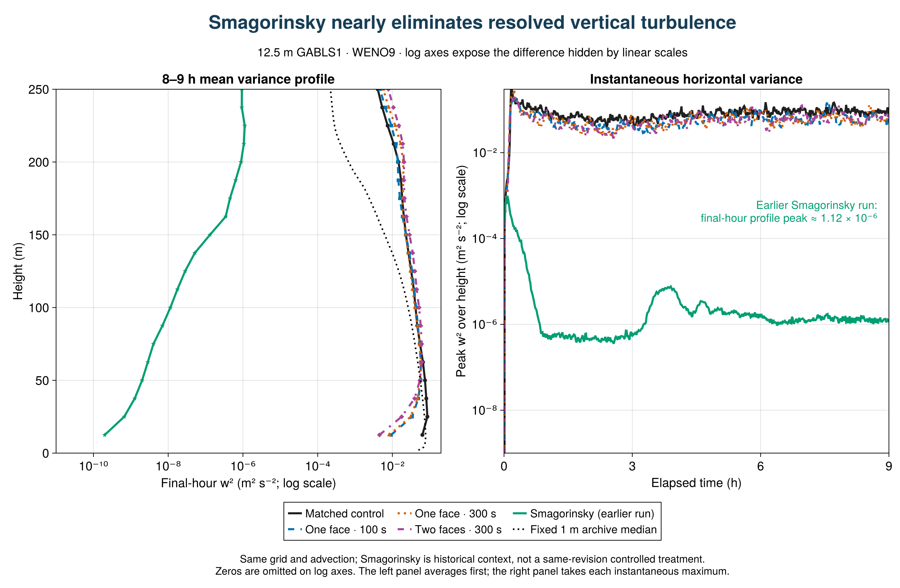
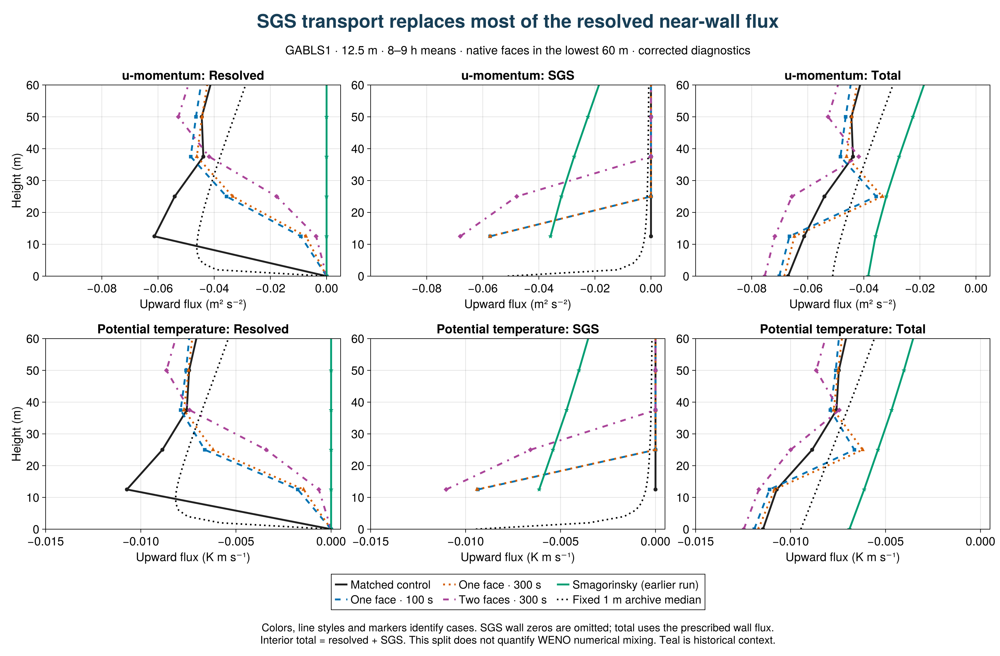

## SurfaceLayerDiffusivity: strong response, no improvement in this coarse GABLS1 test

**The closure changes the near-wall turbulence substantially, but these three configurations do not improve agreement with the fixed 1 m LES median on the profile measures tested.** This is a preliminary result from four completed, paired 9 h runs at 12.5 m resolution (32³ cells, 400 m cube), all using WENO9 and the same frozen model source. It is not a conclusion about all resolutions or stable boundary layers.

[Vector figure](figures/sld_physical_response.pdf)

### What changes?

At the first interior face, z = 12.5 m, final-hour w² falls from 0.0635 m²/s² in the control to 0.00924, 0.00817 and 0.00451 m²/s² with the one-face/100 s, one-face/300 s and two-face/300 s closures: reductions of **85%, 87% and 93%**. The fixed 1 m median at this height is about 0.0774 m²/s². Domain-integrated resolved TKE falls by 18%, 20% and 15%, respectively. The much larger local decrease demonstrates that the response is concentrated near the wall.

At the same face, w³ changes from +0.00902 m³/s³ to small negative values. Skewness changes from +0.56 to −0.21, −0.25 and −0.42. The sign describes asymmetry in vertical motions, not an improvement score. The archive has no directly comparable w³ reference; its available skewness reference is shown separately.

### Does it agree better with the reference?

For the final hour, RMS discrepancies from the fixed 1 m median over native model levels in 0 < z ≤ 200 m are:

| Configuration | Mean u (m/s) | Mean θ (K) | w² (m²/s²) |
|---|---:|---:|---:|
| Matched control | 0.715 | 0.372 | 0.0160 |
| One face / 100 s | 1.009 | 0.431 | 0.0240 |
| One face / 300 s | 0.938 | 0.418 | 0.0245 |
| Two faces / 300 s | 1.147 | 0.463 | 0.0302 |
| Smagorinsky (earlier source) | 0.581 | 0.371 | 0.0395 |

The reference median is linearly interpolated to the native simulation levels for this descriptive calculation; the simulation profiles themselves are not interpolated. The reference is an ensemble of LES, not observational truth. These are unweighted profile errors, not statistical significance tests or a combined ranking.

Final-hour u* increases from 0.279 m/s in the control to 0.292, 0.289 and 0.301 m/s, while the reference average is 0.262 m/s. The surface cooling flux becomes more negative, moving farther from the reference as well. The one-face 100 s and 300 s runs give similar near-wall responses; extending support to two faces strengthens the variance suppression. The direction of the near-wall variance, skewness, surface-drag and resolved-energy changes is also present in the preceding hour, although magnitudes differ. A single seed and two adjacent windows do not establish sampling uncertainty.

[Vector figure](figures/sld_exchange_and_skewness.pdf)

### Comparison with Smagorinsky at 12.5 m

The earlier WENO9 + Smagorinsky run is now shown in teal, with stars on profiles. It uses the same 400 m cube, 32³ grid, 9 h duration and perturbation seed, with Cs = 0.16, Cb = 1 and Pr = 1. Its source revision differs from the four matched SurfaceLayerDiffusivity runs: this is contextual evidence, not a fifth same-revision controlled treatment. Its original export hashes have been verified; [unchanged data and manifest](historical_smagorinsky/manifest.json) and [case settings](historical_smagorinsky/case_metadata.json) are retained alongside the plotting source.

**Smagorinsky has almost no resolved vertical turbulence at this resolution.** The maximum of its final-hour w² profile is 1.12 × 10⁻⁶ m²/s², versus 0.0864 in the matched control and 0.0576–0.0615 in the SLD cases. At z = 12.5 m its w² is only 2.01 × 10⁻¹⁰ m²/s². Its mean resolved-TKE integral is 0.000297 m³/s², versus 34.2 in the matched control. Final-hour u* is 0.223 m/s and surface sensible heat flux is −9.17 W/m². These statistics use the same windows as the other cases.

The mean-u RMS discrepancy is smaller than in the matched control and the mean-theta discrepancy is similar, despite the absence of appreciable resolved turbulence. Mean-profile agreement alone therefore misses a major difference in the simulated flow. The logarithmic variance plots expose this contrast; most Smagorinsky skewness levels are masked because their variance is below the threshold. The fixed 1 m archive contains no directly comparable time series of the instantaneous vertical maximum of w², so that panel has no reference curve.

[Vector figure](figures/sld_smagorinsky_variance.pdf)

### Should surface-layer viscosity act only on u and v?

That is a useful controlled test. The present SurfaceLayerDiffusivity applies vertical diffusion to all three momentum components. Removing its contribution to w would isolate the effect of direct vertical-velocity damping, while keeping its horizontal-momentum transport. However, changing u and v still changes shear production and its tracer diffusion still changes stratification, so w² can respond even without direct w diffusion. The existing comparisons do not identify which mechanism dominates.

A clean next comparison would retain the one-face, 300 s configuration, tracer diffusivity, grid, initialization and forcing, and change only whether the SLD viscosity acts on w. The implementation also needs an explicit check of both the tendency and vertically implicit solve. No u/v-only result is included here, and the historical Smagorinsky result does not establish that this modification would improve fidelity.

### Where does the missing resolved transport go?

**The corrected diagnostics show that SGS mixing carries 86–95% of the first-level u-momentum flux in the SLD cases.** At z = 12.5 m, the final-hour means are:

| Configuration | Resolved u′w′ | SGS u-momentum flux | Total u-momentum flux | SGS / total magnitude |
|---|---:|---:|---:|---:|
| Matched control | −0.06128 | 0 | −0.06128 | 0% |
| One face / 100 s | −0.00915 | −0.05737 | −0.06653 | 86% |
| One face / 300 s | −0.00734 | −0.05741 | −0.06476 | 89% |
| Two faces / 300 s | −0.00373 | −0.06802 | −0.07175 | 95% |

Flux units are m²/s²; negative values indicate downward transport of positive u momentum. SGS flux largely replaces resolved flux: the total magnitude is only 9%, 6% and 17% larger than the control, even as the resolved contribution falls sharply. The corresponding total potential-temperature flux magnitudes rise by about 4%, 1% and 9%; SGS supplies 84%, 87% and 94% of those totals. The transport split helps explain how surface exchange can persist alongside reduced resolved turbulence. It does not establish which damping mechanism controls w², nor does it demonstrate improved fidelity. These totals include resolved plus explicit closure transport; they do not measure WENO numerical mixing.

[Vector figure](figures/sld_flux_partition.pdf) · [Exact flux audit and coefficients](corrected_flux_audit.json)

The four corrected runs reproduce every previously reported mean-field and resolved-moment profile exactly. The new diagnostic evaluates the native implicit coefficient–gradient products before averaging. GPU validation and an independent export audit check nonzero supported SGS flux, zero flux outside the one- or two-face support, exact output schedules and interior total = resolved + SGS within Float32 reduction tolerance. At the wall, the total uses the prescribed boundary flux; the artificial SGS wall zero is omitted from the figure.

### Historical diagnostic exclusion

The original array 7156 reported zero SGS flux because its generic diagnostic omitted the vertically implicit contribution. Its SGS/combined fluxes, stress-based depth and dependent budgets remain excluded. Its files and [exclusion record](diagnostic_exclusions.md) are preserved unchanged; passing file/shape/hash checks did not establish physical semantics. The current figures use the separately archived, corrected array 7293. No boundary-layer-depth or production-budget conclusion is drawn here.

### Reproduce and extend

The final-hour profiles average the two true half-hour windows ending at 30600 and 32400 s. Surface/energy statistics use 60 instantaneous samples at 28860:60:32400 s. Skewness is the ratio of window-mean third moment to variance raised to 3/2; levels with w² < 10⁻⁶ m²/s² are omitted in its plot. The preceding-hour sensitivity uses bins ending at 27000 and 28800 s.

[Julia figure and analysis source](present_results.jl) · [Julia transport plots](plot_fluxes.jl) · [Julia flux audit](audit_corrected_fluxes.jl) · [Exact metrics, definitions and hashes](physical_response_summary.json) · [Physical summary table](physical_response_table.md) · [Corrected export collection](collection_e0655cf/manifest.toml) · [Historical export collection](collection_0bfa03d/manifest.toml)

Breeze source: `02a16478869abf556a464f0874925510bb7c233c`; scientific evaluation source: `a14c3586708de70cd3a47f44878991a440678442`; export analysis: `e0655cf77568bc24af1b0bcd7a4c9efe46aa9f45`. Four-case array: `7293`. [Source-bound GPU validation](../gpu_validation_7241_admitted.toml) and [timing/flux semantic checks](../gpu_semantics_7241_admitted.toml) precede this admission. The corrected collection admitted all four cases with no rejected exports.

The next evidence needed is the matched GABLS3 transfer test and the bounded neutral-flow check. GABLS3 replacement runs are held for an independent surface-humidity boundary-condition review and validation of its correction. The present GABLS1 result is a reason to investigate the closure's strength and support, not to tune it to one aggregate metric. Original DYCOMS and GABLS1 studies are retained in the master report.
