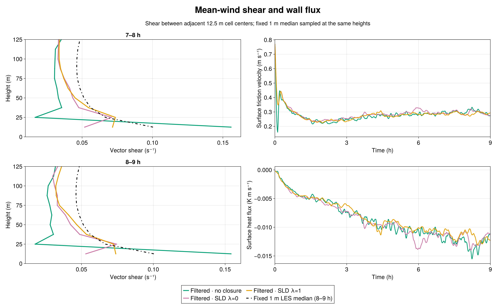
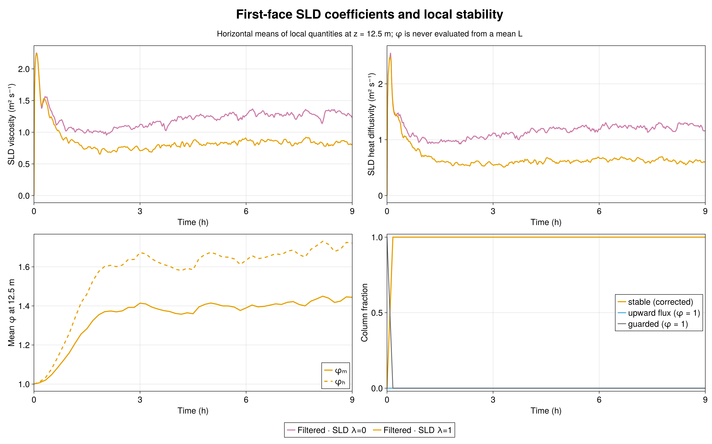
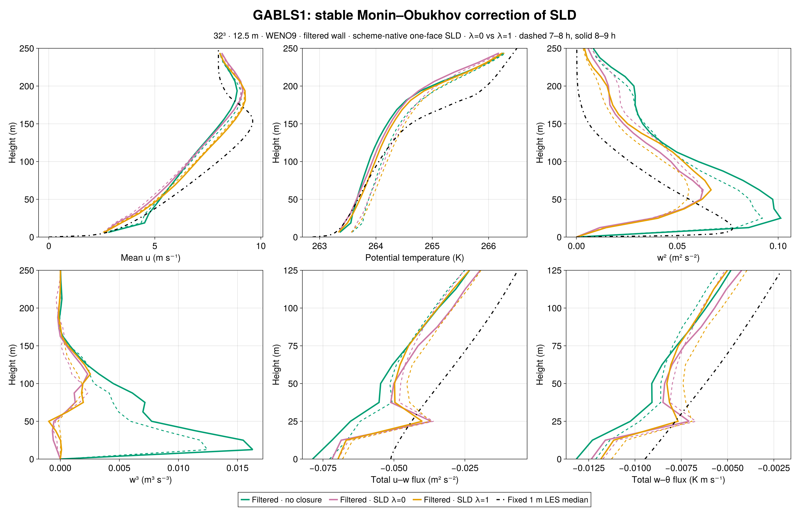
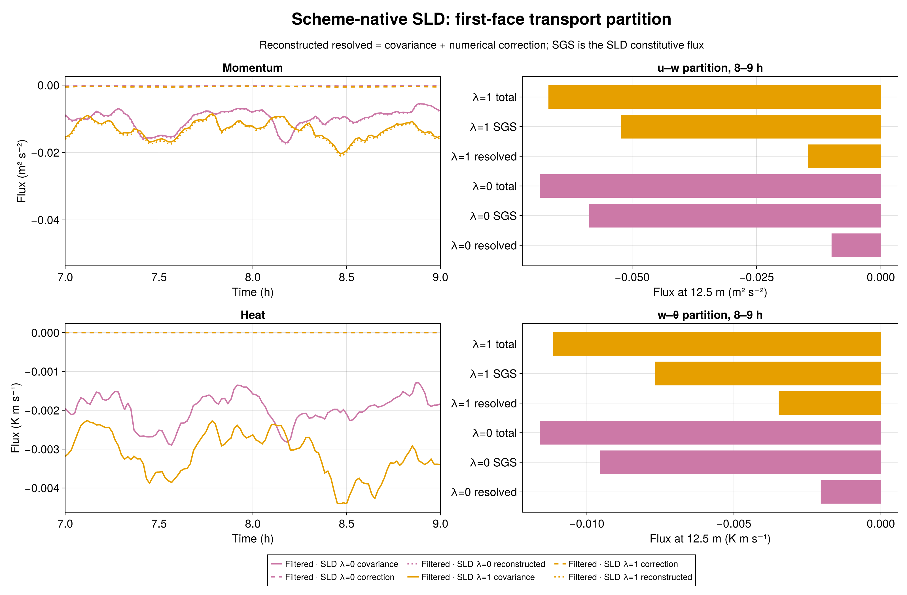

# GABLS1: stable similarity correction for SurfaceLayerDiffusivity

The matched nine-hour, 32³ GABLS1 experiment shows a **partial improvement in near-wall mean-wind shear** when the stable Monin–Obukhov gradient functions are added to scheme-native, one-face SurfaceLayerDiffusivity (SLD). The 8–9 h shear between the lowest two 12.5 m cell centers increases from **0.05302 s⁻¹** with neutral SLD (λ=0) to **0.07387 s⁻¹** with λ=1. The fixed 1 m LES intercomparison median, sampled at the same heights, is **0.10038 s⁻¹**. Thus λ=1 closes about 44% of the neutral SLD shear shortfall in this one matched realization, while leaving a substantial shortfall. Filtered wall drag without an interior closure gives 0.15407 s⁻¹.

## What changed

The existing GABLS wall-exchange law already uses stable similarity slopes βₘ=4.8 and βₕ=7.8. This experiment changes only the **interior SLD coefficient**: νₛₗ is divided by φₘ=1+λβₘz/L and scalar Kₛₗ by φₕ=1+λβₕz/L, using λ=1. A local L is computed per column from the same 300 s filtered surface stress and kinematic potential-temperature flux that drive SLD. The wall law, 300 s wall-state filter, 300 s SLD filter, 400 m cube, 32³ grid (12.5 m), WENO9 advection, seed 123, one-face support, factor-one scheme-native resolved flux, and nine-hour forcing are matched to the admitted λ=0 control. The fixed 1 m median is an LES intercomparison reference, **not an observation or a calibration target**.

The new stable branch was active in **100% of columns** in both 7–8 h and 8–9 h, with no upward-flux fallback after the first hour. At 8–9 h, the horizontal means of the *local* first-face functions are φₘ=1.437 and φₕ=1.710; median local L is 137.9 m. This reduces the measured first-face mean momentum viscosity from 1.2892 to **0.8239 m² s⁻¹** and heat diffusivity from 1.2396 to **0.6045 m² s⁻¹**. These are outcomes of a newly evolved LES, not divisions of frozen neutral coefficients.

## Flow response

The 7–8 h shear likewise increases from 0.05184 to **0.07162 s⁻¹**. The 8–9 h peak resolved w² changes from 0.06276 to **0.06676 m² s⁻²**; it remains well below the filtered no-closure peak of 0.10125. The near-surface third moment is still small: w³ at 18.75 m changes from −2.95×10⁻⁴ to **+1.02×10⁻⁴ m³ s⁻³**, compared with +1.63×10⁻² without closure. This is not a convincing recovery of the stronger turbulent asymmetry in the no-closure run. Mean friction velocity changes from 0.29485 to **0.28907 m s⁻¹** and mean kinematic surface heat flux from −0.012333 to **−0.011838 K m s⁻¹**.

At the first face, the 8–9 h u–w resolved transport becomes more negative (−0.00991 to **−0.01461 m² s⁻²**) while SLD transport becomes less negative (−0.05866 to **−0.05222 m² s⁻²**). Resolved w–θ transport changes from −0.00204 to **−0.00347 K m s⁻¹**, and SLD w–θ transport from −0.00956 to **−0.00768 K m s⁻¹**. The reconstructed scheme-native flux includes the measured WENO numerical correction; the correction is reported separately from covariance. It does not account for the large shear change.

This is **one seed at one resolution**. The result establishes a coherent sensitivity of the matched GABLS1 run to the stable interior coefficient, not a universal optimal λ or demonstrated grid convergence. In particular, improved first-layer shear does not by itself validate w², w³, or the full boundary-layer structure.

## Validation and provenance

The implementation is Breeze commit `b0338bc2921526431763e54caf41675ad062a5d4` and the matched case/analysis is BreezeEvaluation commit `a07427fcdf42824cfa214b69401f1234eb3a582d`. The immutable pcluster source freeze has SHA-256 manifest digest `0ee0541c0f12700a4497a78a083fe868eb4c83db8c98d700adf6ac35a4b7c25f`. The 600 s CPU check passed 48/48; the H100 gate (Slurm 7580) passed GPU parity 34/34 and the 1,800 s case 48/48 with durable exit zero. Science job 7581 ended with durable exit zero and `CASE_DONE final_time_s=32400.0`.

Independent Julia audits admitted 46 native-height profiles, 135 series, exact scheduled times, finite fields, matching initial θ digest `1f5db33f2971ee607ac46b1a014b038a09fc876cc1669394dce023a9aa2f198b`, evolving filtered wall state, density-consistent surface fluxes, and scheme-native transport identities. A separate audit recomputed every saved local 1/L and φ from filtered wall fluxes at 55 times from 0 to 32,400 s; the largest upward-flux column fraction after 1 h was zero. The source freeze intentionally omits `.git`, so the run's automatic Git query says unavailable; the external commit records and verified freeze manifest supply source provenance. Earlier DYCOMS, GABLS1, GABLS3, neutral, factor, scheme-native, and filtered-wall evidence remain unchanged.

The [metrics](metrics.md), [stability audit](export/stability_audit.toml), [raw-output audit](export/audit.toml), [compact profiles and series](export/), [figure code](compare_stability.jl), and [source manifest](evidence/source_sha256.txt) accompany this chapter. The raw JLD2 files and checkpoints remain in `/shared/home/greg/review-coordination/sld-stability-20260923/` on pcluster.
