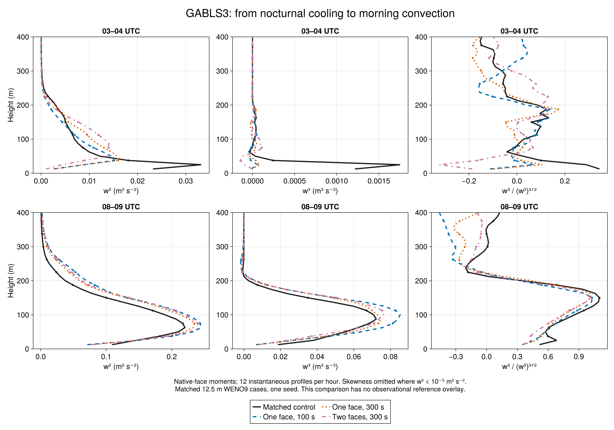
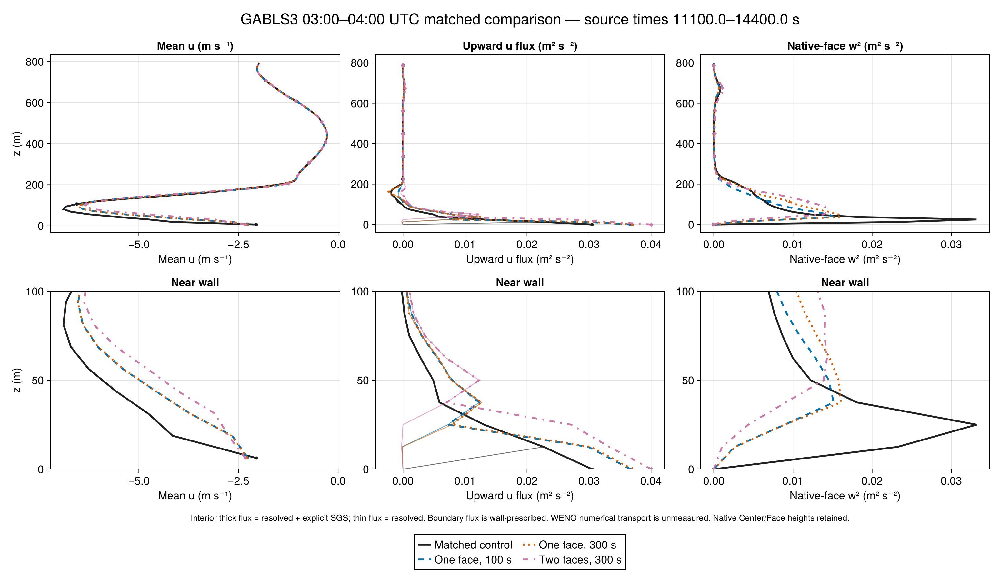
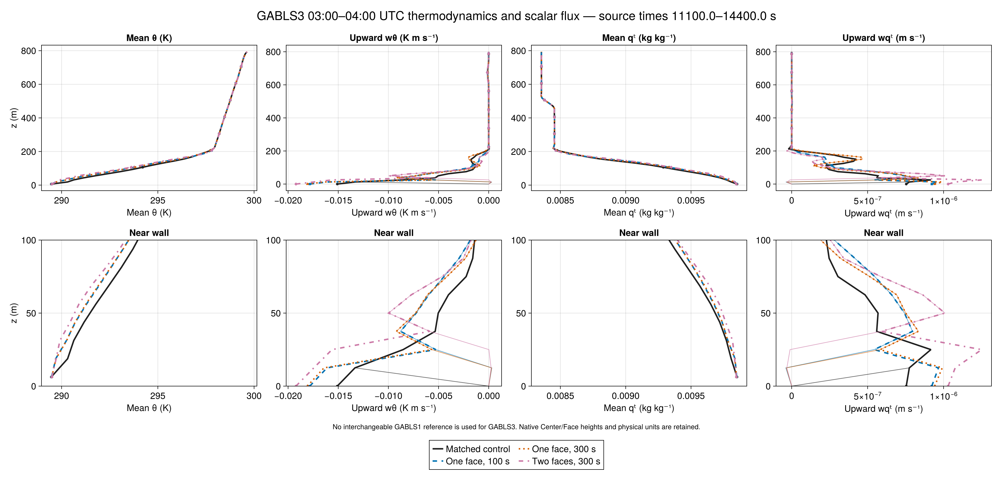
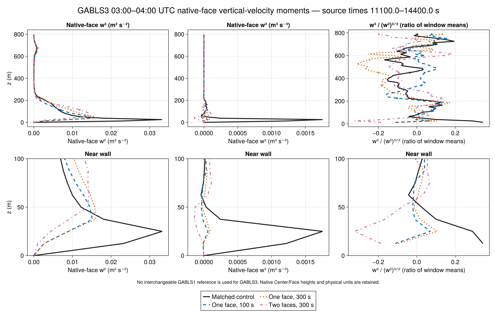
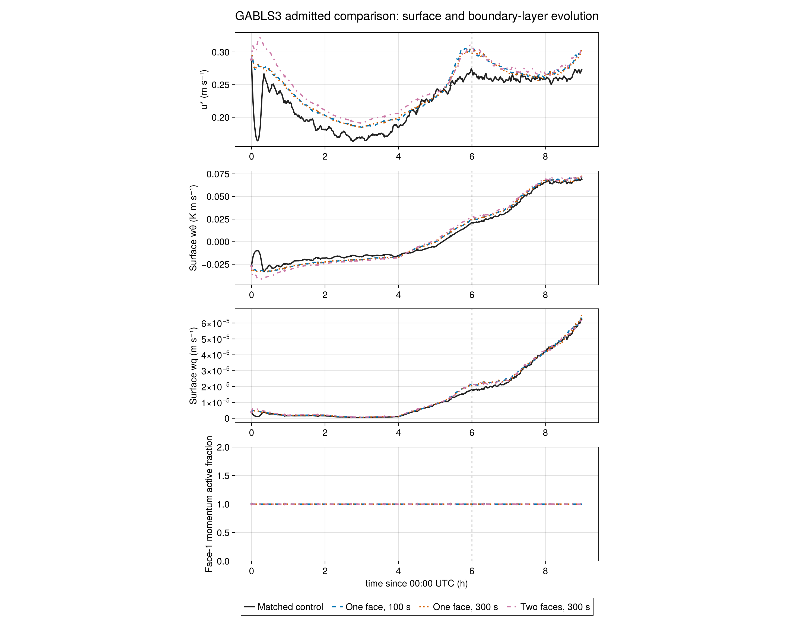
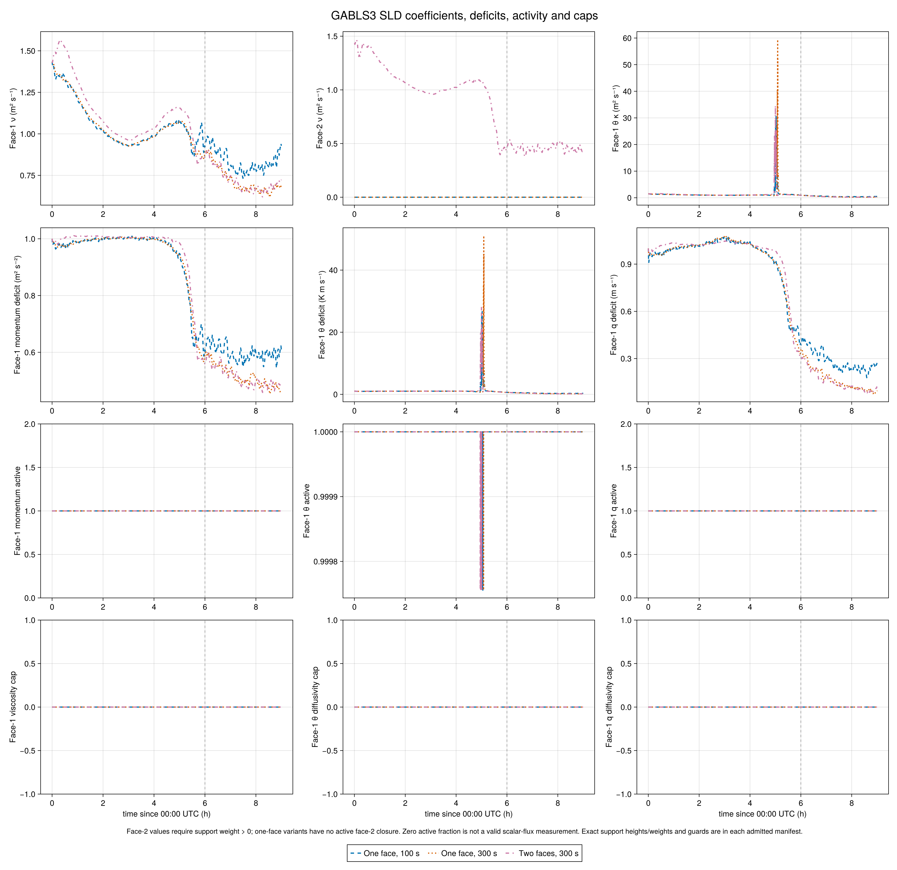

# SurfaceLayerDiffusivity: GABLS3 results

Four matched 9-hour GABLS3 runs | 12.5 m isotropic grid, 64³ cells, 800 m cube | WENO9 | seed 20260702.

The corrected control and three SurfaceLayerDiffusivity variants have completed and passed independent export and physical-flux audits: 109 instantaneous profile times, 3241 series and 3241 point records per case. The comparison varies one-face support with 100 or 300 s filtering, and two-face support with 300 s filtering. All use the same frozen simulation source.

During 03–04 UTC, SLD suppresses first-face vertical variance by 88–96% relative to the matched no-interior-closure control. At z=12.5 m, w² decreases from 0.02320 to 0.00260, 0.00270 and 0.00104 m²/s². Skewness changes from +0.344 to -0.112, -0.097 and -0.186. Domain-integrated resolved TKE decreases by 32–36%. These near-wall responses resemble the GABLS1 comparison.

The morning response differs. During 08–09 UTC, SLD first-face w² remains 28–35% below the control, but domain-integrated resolved TKE is 30–36% higher. Peak w² is 7–11% higher. Mean sensible heat flux is 82.6–84.1 W/m² upward, compared with 80.2 W/m² in the control. Local suppression therefore does not imply suppression of the whole convective layer.

One-face 100 and 300 s results are relatively close in these diagnostics: first-face w² differs by about 4% during 03–04 UTC and 9% during 08–09 UTC. Two-face support produces substantially stronger nocturnal near-wall suppression. These are single-seed results without sampling-uncertainty estimates; differences cannot be attributed solely to direct damping of w because surface exchange and mean shear also respond.

Profiles average twelve instantaneous outputs in each hour: 11100:300:14400 s or 29100:300:32400 s. This differs from GABLS1's saved half-hour means. Skewness is the ratio of averaged central moments. The transition figure masks skewness where w² is below 10⁻⁵ m²/s²; full diagnostic figures retain native data.

These plots compare Breeze variants, not fidelity against observations. No GABLS1 median is used as a GABLS3 reference. GABLS3 observational and LES sources remain described in Part III of the master. Quantitative observational agreement, boundary-layer growth relative to the 600 m sponge onset, and sampling uncertainty remain to be assessed before claiming improvement.

Flux definitions: interior total means resolved covariance plus explicit SGS transport; it excludes unmeasured WENO numerical transport. Bottom values are wall-prescribed fluxes and are audited separately. The corrected humidity boundary condition and exact forcing schedule passed the source-matched GPU gate before production. Historical GABLS3 outputs with the earlier humidity treatment remain excluded.

Provenance: array 7343, GPU gate 7335; simulation core Evaluation 131ad9b and Breeze 02a1647. Analysis b144835 preserves the exact raw values while documenting Float32 storage in the final record of three prescribed surface-forcing scalars; preceding records are Float64. Raw files and simulation source were not changed. All four exports and the collection passed hash, native-height, schedule and physical flux checks.

[Vector figure](figures/gabls3_transition.pdf)

[Vector figure](figures/gabls3_sld_profiles.pdf)

[Vector figure](figures/gabls3_sld_scalars.pdf)

[Vector figure](figures/gabls3_sld_moments.pdf)

[Vector figure](figures/gabls3_sld_timeline.pdf)

[Vector figure](figures/gabls3_sld_closure.pdf)

