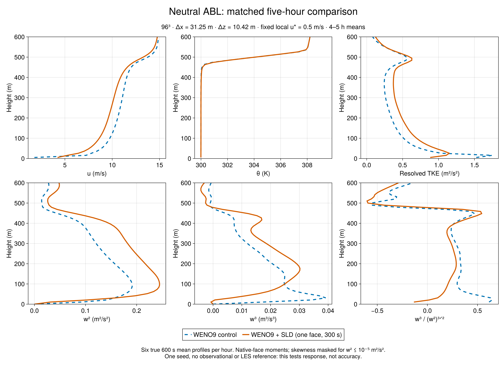
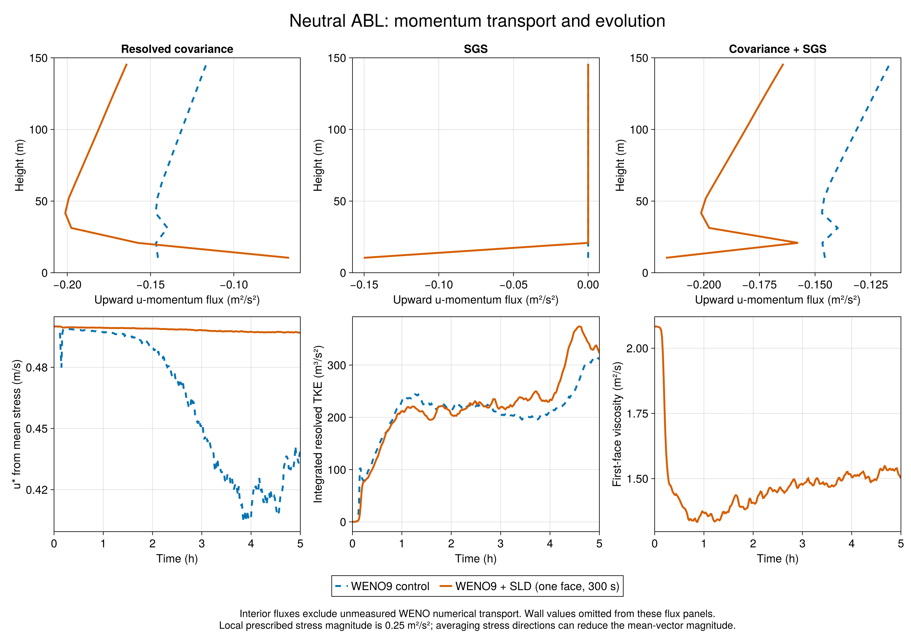

# SurfaceLayerDiffusivity: neutral ABL

Two matched five-hour neutral ABL runs: WENO9 with no interior closure versus one-face SurfaceLayerDiffusivity with a 300 s filter. Both use a 96³ grid in a 3000 × 3000 × 1000 m domain (31.25 m horizontal, 10.42 m vertical), seed 1994, identical forcing and initial state. The surface prescribes local u* = 0.5 m/s and zero heat flux. This is a fixed-stress test, not a test of a predicted drag coefficient or MOST surface exchange.

During 4–5 h, SLD reduces first-interior-face vertical variance from 0.09209 to 0.03061 m²/s², a 66.8% decrease at z = 10.42 m. The third central moment changes from +0.01718 to -0.000720 m³/s³, and skewness from +0.615 to -0.134. This repeats the near-wall suppression and asymmetry reversal seen in the stable cases, even though the neutral scalar guard is inactive.

The response is not uniform through the layer. Peak w² rises from 0.1915 to 0.2448 m²/s² (27.8%), while vertically integrated resolved TKE rises from 260.0 to 319.8 m³/s² (23.0%). Near-wall suppression therefore coexists with more resolved energy elsewhere. These differences cannot be attributed solely to direct w damping: mean shear, momentum transport and turbulence organization also respond.

The neighboring 3–4 h window has similar first-face w² (0.09272 control, 0.03074 SLD) and skewness (+0.588, -0.147), but integrated TKE is lower (202.5, 231.7 m³/s²). The layer is still evolving. Five hours and one seed do not establish equilibrium, sampling uncertainty, or improved accuracy. No external neutral LES or observational reference is included.

Each plotted final-hour profile is the equal mean of six true 600 s averages ending at 15000:600:18000 s. Moments retain native vertical-face coordinates. Skewness is the ratio of averaged central moments, masked where w² ≤ 10⁻⁵ m²/s². Interior total flux means covariance plus SGS and excludes unmeasured WENO numerical transport. The wall law fixes local stress magnitude; averaging differently directed vectors can lower the magnitude of the mean stress and its diagnosed u*.

Both cases passed full saved-output scientific admission: 30 averaged profiles plus separate t=0 data, 301 series and bounds records, six finite hourly checkpoints, source and output hashes, native coordinates, zero heat/scalar guard, and momentum flux checks. The original batch wrappers retain code-3 failure records because a post-run rg command was missing. Independent audit of the pinned wrapper and logs establishes that each solver returned zero first; a separate Codex-root acceptance records this distinction. No GPU rerun or raw-data edits were made.

Measured run! wall times were 6.506 min (control) and 6.725 min (SLD), including run initialization; complete attempt durations were about 14.1 and 15.5 min including process startup and other setup. These single timings are not a robust performance benchmark. Simulation source: Evaluation a14c358 / Breeze 02a1647; analysis c9220b1; original array 7367; collection 2 admitted, 0 rejected. All earlier DYCOMS and GABLS material is preserved.

