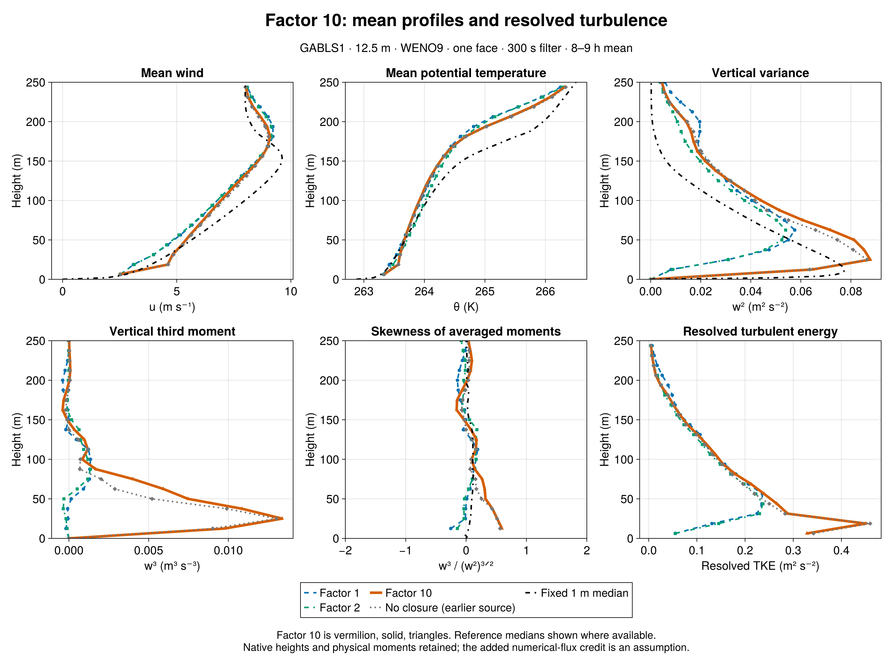
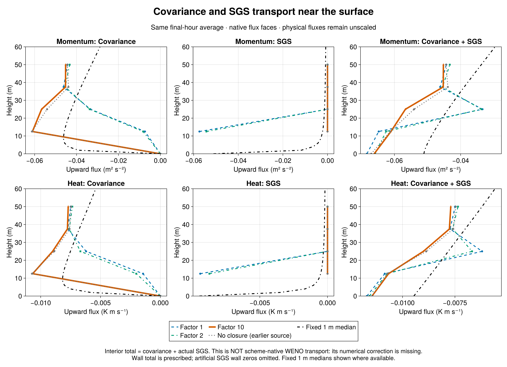
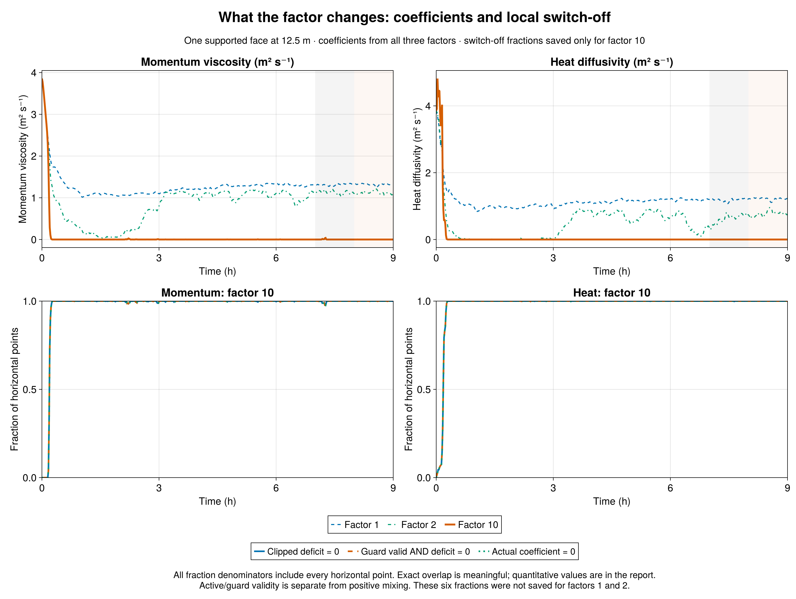

# Factor 10 mostly switches the closure off

GABLS1 factor-10 sensitivity | 21 September 2026 | 12.5 m, WENO9, one interior face, 300 s filter, 9 h, seed 123. All earlier factor-1/2 results are retained separately.

Result: factor 10 largely removes the added surface-layer mixing after spin-up. Resolved turbulence then resembles the earlier no-closure run. In 8-9 h, first-face w² is 0.064671 m²/s², versus 0.00817056 for factor 1, 0.00875396 for factor 2, and 0.0635343 without closure. Factor 10 is 7.92 times factor 1 and only 1.79% above the no-closure value. This is recovery of resolved turbulence, not proof of accurate total transport.

Mechanism: the multiplier acts only inside the signed local deficit, max(0, 1 - a F_resolved/F_target), for momentum and heat. With a=10, aligned resolved transport carrying 10% of the target can satisfy the deficit. Countergradient transport increases it. Crediting ten times the resolved flux assumes a missing contribution nine times as large; the experiment does not measure that contribution. Physical covariance diagnostics are never multiplied.

The saved fractions explain the response. In the final hour, momentum viscosity is exactly zero at 99.9934896% of sampled horizontal point-times; heat diffusivity is zero at 100%. The corresponding raw-zero-deficit and guard-valid-zero-deficit fractions agree. Momentum and heat guards remain valid at 100%, with zero coefficient-cap activity, so this is deficit satisfaction rather than guard failure. Each value averages 60 one-minute samples over all 32×32 horizontal points. It does not imply continuous switch-off between samples: true averaged SGS heat flux is tiny but nonzero, -1.26136e-08 K m/s. These six fractions were not saved for factors 1/2 and remain unavailable there.

The closure acts during spin-up. During 0-1 h, mean viscosity is 0.5168 m²/s and heat diffusivity is 0.6870 m²/s; zero-coefficient fractions are about 81.54% and 82.98%. By 1-2 h, momentum is zero at 99.9837% of sampled points and heat at 100%. Small intermittent reactivations remain later. In 8-9 h the mean viscosity is 2.72361e-05 m²/s, versus 1.32118 and 1.11797 for factors 1 and 2; sampled mean heat diffusivity is zero.

Moments and energy: factor-10 first-face w³ is +0.00977604 m³/s³ and skewness +0.59443, compared with negative values for factors 1/2 and +0.56311 without closure. Final-hour peak w² is 0.0877192, and integrated resolved TKE is 35.1207 m³/s², 28.83% above factor 1. The response persists in 7-8 h: first-face w² is 0.0668137, skewness +0.58543, and integrated TKE 35.2916. Neighboring hours and one seed are not an uncertainty estimate.

Transport and exchange: final-hour SGS carries 0.012852% of first-face u-momentum covariance-plus-SGS transport, versus 88.66% and 86.82% for factors 1/2. Factor-10 u* is 0.279088 m/s and surface sensible heat flux -15.2328 W/m², close to the no-closure values 0.279164 and -15.2131. The plots' quantity called total is covariance plus actual constitutive SGS. It is NOT the scheme-native WENO advective flux plus SGS: the numerical correction to covariance has not been reconstructed. Agreement of that plotted quantity with a reference cannot validate the missing numerical contribution.

Reference comparison: relative to factor 1, final-hour native-level RMS errors against the fixed 1 m LES median fall 17.33% for u, 9.354% for theta, and 27.43% for w². Nevertheless, factor-10 errors remain larger than the no-closure errors for all three quantities in 8-9 h. The reference is an LES ensemble median, not observations. This strong sensitivity chiefly approaches the no-closure regime; it does not establish factor 10 as a calibrated or faithful correction.

Comparison integrity: factor10 passed separate strict admission (1 admitted, 0 rejected), with 19 native profiles, 541 exact series times, finite values, supported-face SGS and covariance-plus-SGS consistency. Factors1/2 retain their original admission. Breeze physics commit is identical; factor10's evaluation revision adds read-only diagnostics, with source-specific GPU validation (4,462 checks). Initial native profiles match exactly. Fresh factor1 already reproduces every corrected historical one-face300 profile and series value bit for bit. The earlier no-closure run is labeled as source context. Job7339 used a non-login wrapper and its durable child record verifies exit zero. The preserved older factor2 scheduler discrepancy is documented separately.

Definitions: plotted 8-9 h profiles average the two true half-hour means ending at 30600 and 32400 s; 7-8 h uses 27000 and 28800 s. Series metrics average samples strictly after the hour start through its end. Skewness is the ratio of averaged third moment to averaged variance^(3/2), omitted for w²<1e-6. Native model heights are retained; only the fixed 1 m median is interpolated for unweighted RMS errors over 0<z<=200 m. No WENO flux reconstruction or additional experiment is included.

| Final-hour quantity | Factor 1 | Factor 2 | Factor 10 | No closure (earlier source) |
|---|---:|---:|---:|---:|
| w² at 12.5 m (m²/s²) | 0.008170558 | 0.008753958 | 0.06467097 | 0.06353432 |
| w³ at 12.5 m (m³/s³) | -0.0001871969 | -0.0001186277 | 0.009776039 | 0.00901795 |
| Skewness at 12.5 m | -0.2534668 | -0.144837 | 0.5944275 | 0.5631126 |
| Integrated resolved TKE (m³/s²) | 27.26025 | 25.51344 | 35.12071 | 34.17832 |
| u* (m/s) | 0.288603 | 0.2830551 | 0.279088 | 0.2791644 |
| Sensible heat (W/m²) | -15.53819 | -15.38412 | -15.23282 | -15.21312 |
| First-face viscosity (m²/s) | 1.321179 | 1.117967 | 2.723608e-05 | 0 |
| First-face heat diffusivity (m²/s) | 1.21593 | 0.774134 | 0 | 0 |
| u RMS error (m/s) | 0.9376947 | 0.9405706 | 0.7752186 | 0.7146622 |
| theta RMS error (K) | 0.4176555 | 0.3790953 | 0.3785895 | 0.3720045 |
| w² RMS error (m²/s²) | 0.02453778 | 0.02275783 | 0.01780806 | 0.01601883 |

| Factor10 saved horizontal fraction | 7-8 h | 8-9 h |
|---|---:|---:|
| momentum_deficit_zero_fraction | 0.9981933594 | 0.9999348958 |
| momentum_valid_zero_deficit_fraction | 0.9981933594 | 0.9999348958 |
| viscosity_zero_fraction | 0.9981933594 | 0.9999348958 |
| ρθ_deficit_zero_fraction | 0.9999674479 | 1 |
| ρθ_diffusivity_zero_fraction | 0.9999674479 | 1 |
| ρθ_valid_zero_deficit_fraction | 0.9999674479 | 1 |

Fractions for factors1/2 are unavailable, not zero. The no-closure coefficient is identically zero by construction.

[Detailed comparison](comparison.md) · [Complete metrics and hourly fractions](comparison.json) · [Native profiles](comparison_profiles.csv) · [Julia audit](compare.jl) · [Julia plots](plot_comparison.jl) · [Strict collection](collection_v2/manifest.toml)

Sources: [Breeze 1df78f2](https://github.com/NumericalEarth/Breeze.jl/commit/1df78f2bb94db159e3a296f7439e1a5e90286014), [factor10 evaluation cbe90ce](https://github.com/glwagner/BreezeEvaluation.jl/commit/cbe90cee275866f742275127de95b6148d2a4653). Earlier factor1/2 exports and reference data remain linked through the Julia audit.
