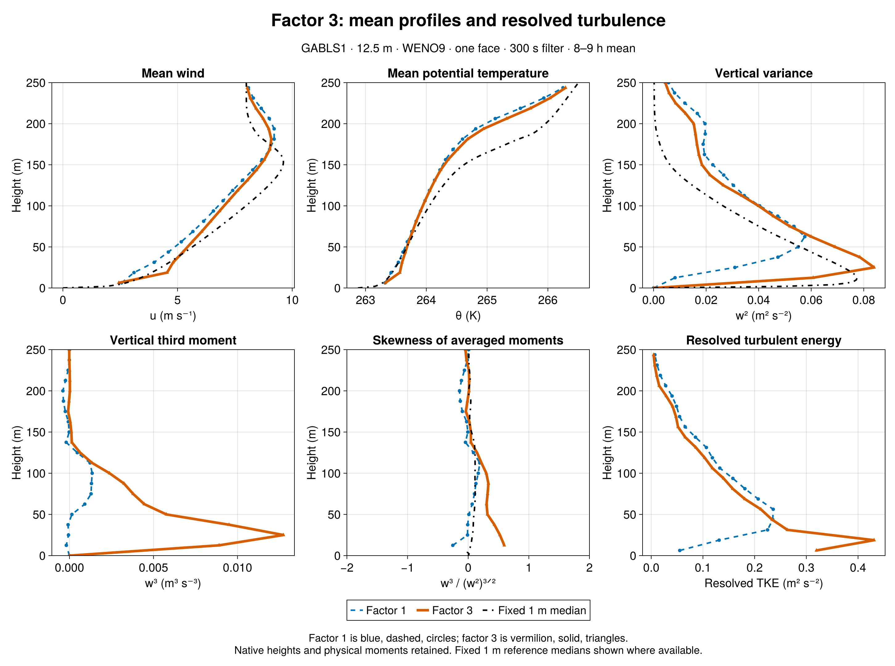
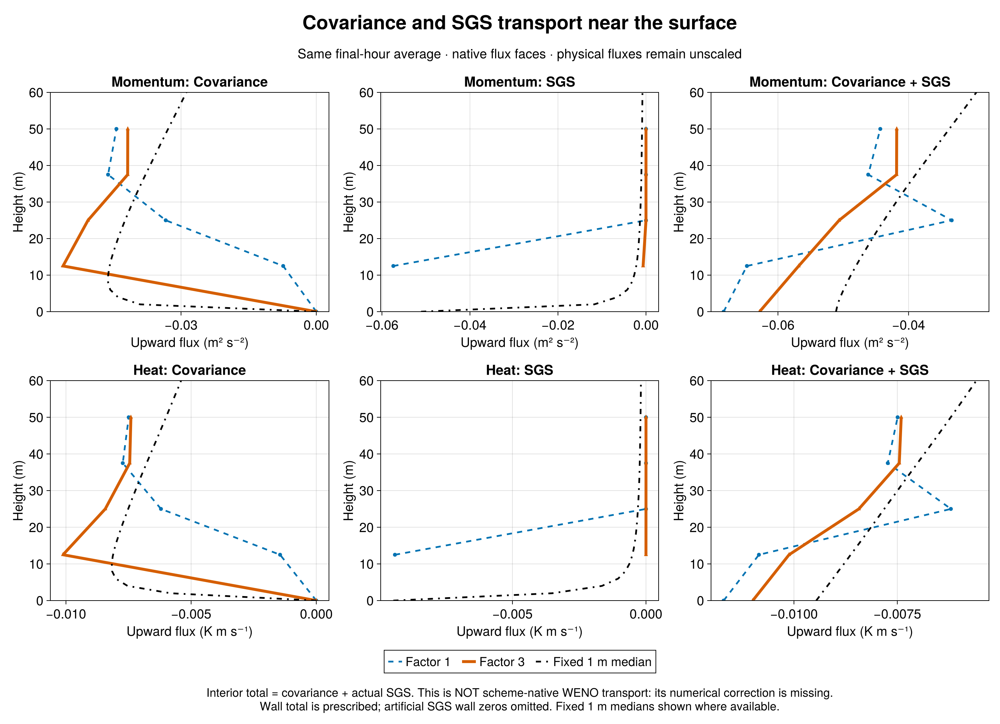
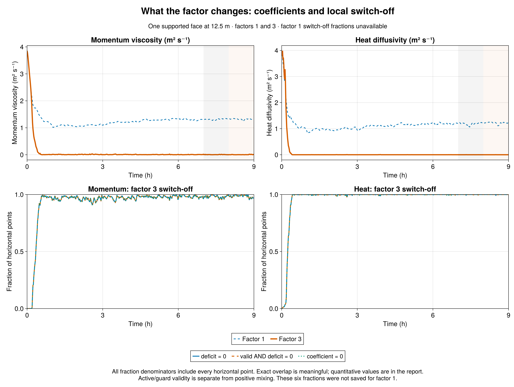

# Factor 3 mostly switches the closure off

GABLS1 factor-3 sensitivity | 22 September 2026 | 12.5 m, WENO9, one interior face, 300 s filter, 9 h, seed 123. New plots compare only factors 1 and 3, with fixed 1 m LES reference medians where available. Earlier reports and data are preserved.

Result: factor 3 largely switches off the added near-surface closure after spin-up, while resolved turbulence increases strongly. In 8-9 h, first-face w² rises from 0.00817056 to 0.060734 m²/s², a factor of 7.433. Integrated resolved TKE increases 16.38%. First-face w³ and skewness change from negative to positive. This is a large response to the assumed missing-transport credit, not a calibrated accuracy result.

The intervention remains narrow: multiply signed, locally time-filtered resolved flux by three only inside max(0, 1 - a F_resolved/F_target), for momentum and heat. Aligned resolved transport reaching one-third of the target can eliminate that local deficit; countergradient transport increases it. The assumed extra transport is twice the resolved contribution. Coefficients respond dynamically; neither viscosity nor plotted covariance is simply multiplied by three.

Closure response: final-hour mean first-face viscosity falls from 1.32118 to 0.00417626 m²/s; heat diffusivity falls from 1.21593 to 7.01368e-05 m²/s. Factor-3 viscosity is exactly zero at 98.473307% of sampled horizontal point-times, and heat diffusivity at 99.975586%. The timeline shows substantial initial mixing followed by mostly inactive coefficients, with intermittent reactivation. This is a change in the closure's operating regime, not simply a small uniform reduction in its strength.

Fraction interpretation: each hourly value averages 60 one-minute samples over all 32×32 horizontal points. Raw zero deficit, guard-valid zero deficit and actual zero coefficient are separately retained for momentum and heat; all six fractions appear in the detailed table. All three definitions agree in the final hour. Momentum and heat guards remain valid at 100% and 100%; coefficient-cap fractions are 0 and 0. Thus deficit satisfaction explains the switch-off, rather than invalid targets or active coefficient caps. Sampled zeros do not prove continuous switch-off between outputs. Factor 1 did not save these fractions; its values remain unavailable, not zero.

Moments and hourly sensitivity: factor-3 first-face w³ is 0.00890504 m³/s³ and skewness 0.59496; peak w² is 0.0839403 and integrated resolved TKE 31.7259 m³/s². In 7-8 h, first-face w² is 0.0623155, w³ 0.00902423, skewness 0.580117, and integrated TKE 34.7786. The earlier-hour zero-viscosity/zero-heat-diffusivity fractions are 98.18034% / 99.96582%. The two neighboring windows show time dependence; they do not quantify ensemble uncertainty.

Transport and exchange: the SGS share of first-face u-momentum covariance-plus-SGS transport falls from 88.6586% with factor 1 to 1.14829% with factor 3. Factor-3 u* is 0.272265 m/s and sensible heat flux -14.5912 W/m², versus 0.288603 m/s and -15.5382 W/m² for factor 1. Every plotted interior total is covariance plus actual constitutive SGS. It is NOT scheme-native WENO advective transport plus SGS: the numerical correction to covariance remains unmeasured. The factor experiment cannot identify or validate that missing flux.

Reference comparison: at native heights 0<z<=200 m, factor-3 final-hour RMS errors against the fixed 1 m LES median are 0.720275 m/s for u, 0.376886 K for theta, and 0.0132648 m²/s² for w². Changes relative to factor 1 are -23.19%, -9.761%, and -45.94%. The reference is an LES median, not observations. Greater resolved variance or a smaller mean-profile error alone does not establish faithful total transport.

Comparison integrity: factor 3 passed its source-specific strict admission (1 admitted, 0 rejected), with identical Breeze physics and initial native profiles, 19 exact profile times and 541 exact series times. Checksums, finite values, native vertical locations, one-face support, covariance-plus-SGS consistency and fraction bounds were verified. Factors 1/2/10 retain their original admissions. Factor 1 reproduces the corrected historical one-face300 output bit for bit; the no-closure case remains labeled as earlier-source context. The durable child record for non-login job 7348 verifies exit zero; no unavailable batch status is inferred.

Definitions: 8-9 h profiles average true half-hour means ending at 30600 and 32400 s; 7-8 h uses 27000 and 28800 s. Series averages exclude the hour start and include its end. Skewness is averaged w³ divided by averaged w² to the three-halves power, masked for w²<1e-6. Native model heights are retained; only the reference is interpolated for unweighted RMS errors. No scheme-native flux reconstruction, new closure design, or additional simulation is included.

| Final-hour quantity | Factor 1 | Factor 3 |
|---|---:|---:|
| w² at 12.5 m (m²/s²) | 0.008170558 | 0.06073402 |
| w³ at 12.5 m (m³/s³) | -0.0001871969 | 0.00890504 |
| Skewness at 12.5 m | -0.2534668 | 0.5949601 |
| Integrated resolved TKE (m³/s²) | 27.26025 | 31.72593 |
| u* (m/s) | 0.288603 | 0.2722648 |
| Sensible heat (W/m²) | -15.53819 | -14.59116 |
| First-face viscosity (m²/s) | 1.321179 | 0.004176262 |
| First-face heat diffusivity (m²/s) | 1.21593 | 7.013677e-05 |
| u RMS error (m/s) | 0.9376947 | 0.7202753 |
| theta RMS error (K) | 0.4176555 | 0.3768861 |
| w² RMS error (m²/s²) | 0.02453778 | 0.01326483 |

| Factor | Saved horizontal fraction | 7-8 h | 8-9 h |
|---|---|---:|---:|
| 3 | momentum_deficit_zero_fraction | 0.9818033854 | 0.9847330729 |
| 3 | momentum_valid_zero_deficit_fraction | 0.9818033854 | 0.9847330729 |
| 3 | viscosity_zero_fraction | 0.9818033854 | 0.9847330729 |
| 3 | ρθ_deficit_zero_fraction | 0.9996582031 | 0.9997558594 |
| 3 | ρθ_diffusivity_zero_fraction | 0.9996582031 | 0.9997558594 |
| 3 | ρθ_valid_zero_deficit_fraction | 0.9996582031 | 0.9997558594 |

Fractions for factor 1 are unavailable, not zero. Archived factor-2/10 and historical-control context remains in the detailed numerical comparison, not in these plots.

[Detailed two-hour comparison](comparison.md) · [Complete metrics and hourly fractions](comparison.json) · [Native profiles](comparison_profiles.csv) · [Julia audit](compare.jl) · [Julia plots](plot_comparison.jl) · [Strict collection](collection_v1/manifest.toml)

Sources: [Breeze 1df78f2](https://github.com/NumericalEarth/Breeze.jl/commit/1df78f2bb94db159e3a296f7439e1a5e90286014), [factor-3 evaluation b9c3102](https://github.com/glwagner/BreezeEvaluation.jl/commit/b9c31029929650c61040a5a20f9699de9a457978). Earlier exports and fixed 1 m reference data remain linked through the Julia audit.
