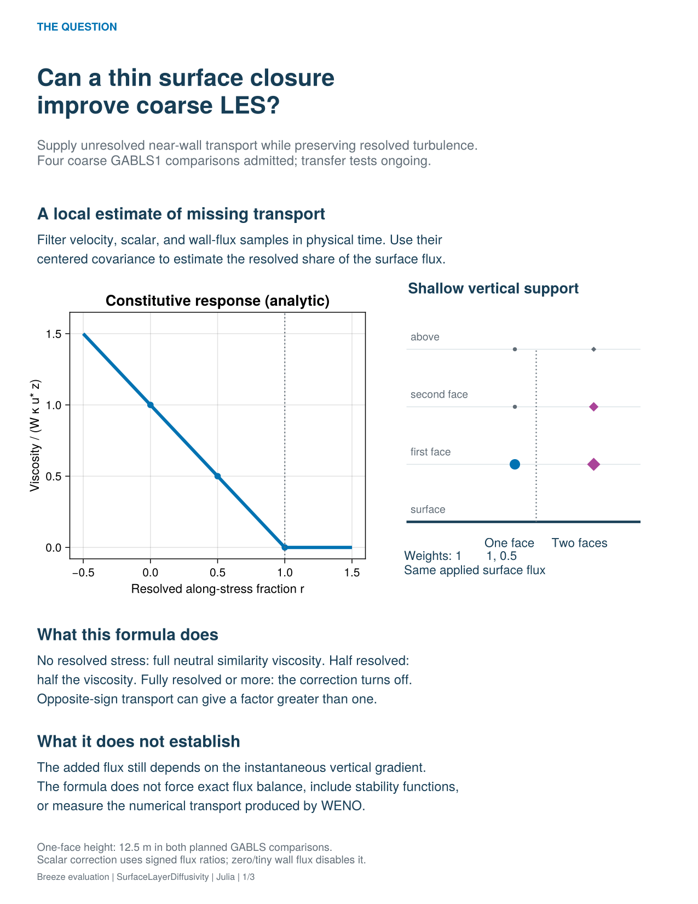
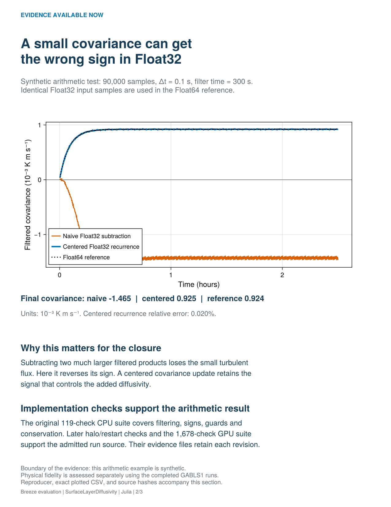
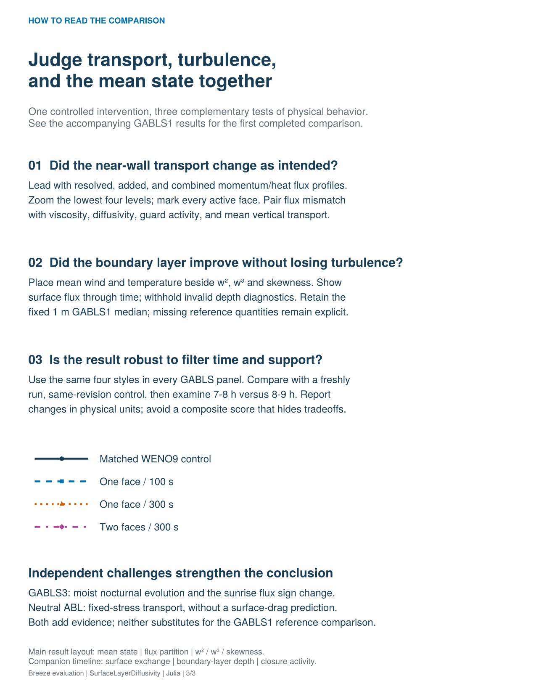

# SurfaceLayerDiffusivity: evidence and evaluation

**Can a thin surface closure improve coarse LES without suppressing resolved turbulence?** The first four coarse GABLS1 runs now provide a physical comparison: substantial near-wall suppression, but no improvement on the reference profile measures tested. Read the [physical results and diagnostic exclusions](gabls1/results.md) first. The illustrations below explain the mechanism, a reproducible arithmetic example, and how to assess the comparison.

## Results available today

The standalone covariance experiment uses the same Float32 samples for all methods, then accumulates the reference in Float64. The naive filtered-product subtraction reverses the final covariance sign. The centered recurrence preserves the sign and closely matches the reference. This is a synthetic arithmetic result, not a heat-flux measurement from an atmospheric simulation. Exact values and the complete plotted history are saved in [presentation evidence](presentation_evidence.json) and [CSV](covariance_arithmetic.csv).

The original implementation evidence contains 119 CPU feature checks; the current source passed 128, including the later halo/restart regression. The source-bound CPU integration harness passed 562 and the GPU suite passed 1,678 checks. These counts describe distinct scopes and are not a scientific confidence score. Four GABLS1 runs completed and passed export integrity checks, but figure review then identified omitted implicit SGS flux in the diagnostic helper. Combined flux, stress-based depth and dependent budgets remain excluded pending correction. This example shows why physical consistency review is needed in addition to automated validation.

## Read the scientific result through three views

| View | What to show | What would undermine the conclusion |
|---|---|---|
| Near-wall mechanism | Native-height resolved, added, and combined flux; active-face markers; coefficients and signed deficits | Mean improvement without the intended transport change; large unexplained transverse mismatch |
| Boundary-layer response | Mean wind/theta, surface exchange, depth, and w²/w³/skewness | Collapsed resolved turbulence or improvement in one quantity accompanied by degradation in another |
| Sensitivity and transfer | 100 versus 300 s; one versus two faces; two hour windows; GABLS3 sunrise and neutral flow | An effect confined to one averaging window or a guard/cap artifact at the flux sign change |

The preliminary comparison puts mean wind and temperature beside w² and w³, with surface exchange, resolved energy and skewness on a second page. The intended transport-partition panel is withheld until the implicit-flux diagnostic is corrected. Each figure states its window, grid and sample definition. Reference gaps remain explicit. Skewness is omitted where variance is too small for a meaningful normalized third moment.

## Controls and presentation conventions

GABLS1 uses a 400 m cube at 32³; GABLS3 uses an 800 m cube at 64³. Each has a newly run WENO9 control plus one-face/100 s, one-face/300 s, and two-face/300 s variants on the same source revision and paired initialization. Earlier GABLS1 runs remain historical context, not the treatment control. The neutral pair retains the prescribed surface stress and therefore cannot establish improved prediction of surface drag.

Use dark solid/circle for the matched control, blue dashed/square for one-face/100 s, vermilion dotted/triangle for one-face/300 s, and purple dash-dot/diamond for two-face/300 s. The fixed 1 m GABLS1 archive median remains black dotted on comparable panels. These SLD figures show the median only; no uncertainty band is inferred. Markers and labels distinguish it from the vermilion treatment. Preserve unavailable values rather than turning them into zero.

Report changes from the matched control in physical units. Compare those changes against the archive reference and temporal variability, without treating an LES ensemble as observational truth or a min/max envelope as a confidence interval. Do not claim that resolved plus explicit flux includes unmeasured WENO numerical transport. Single-seed comparisons do not establish sampling uncertainty.

## Reproducibility

All figures are generated by [Julia source](presentation.jl). The illustrated response is analytic; the covariance trace is synthetic. No missing LES curves or performance values have been filled in. [CPU feature evidence](cpu_validation.json), [integration harness evidence](gpu_harness_cpu_contract.toml), and [export evidence](analysis_export_evidence.toml) accompany the presentation. SHA-256 hashes of its sources and data are recorded in the presentation evidence.

Current run implementation: [Breeze feature 02a1647](https://github.com/NumericalEarth/Breeze.jl/commit/02a16478869abf556a464f0874925510bb7c233c). Evaluation sources: [BreezeEvaluation.jl](https://github.com/glwagner/BreezeEvaluation.jl/tree/glw/surface-layer-evaluation). The original CPU evidence files retain their historical revisions. The [current physical comparison](gabls1/results.md) preserves that history and explicitly excludes the later-discovered invalid flux diagnostics.
